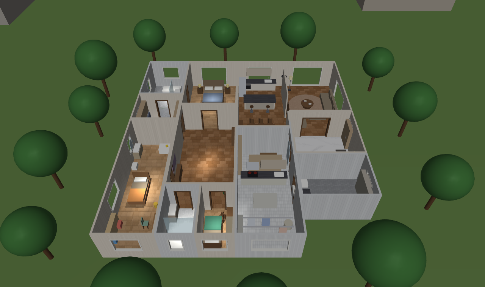
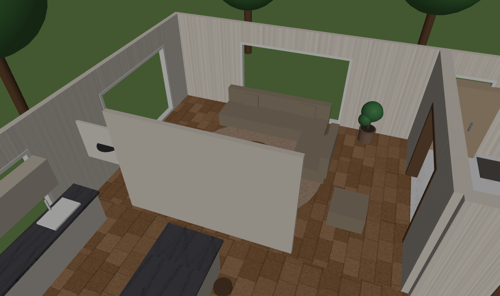
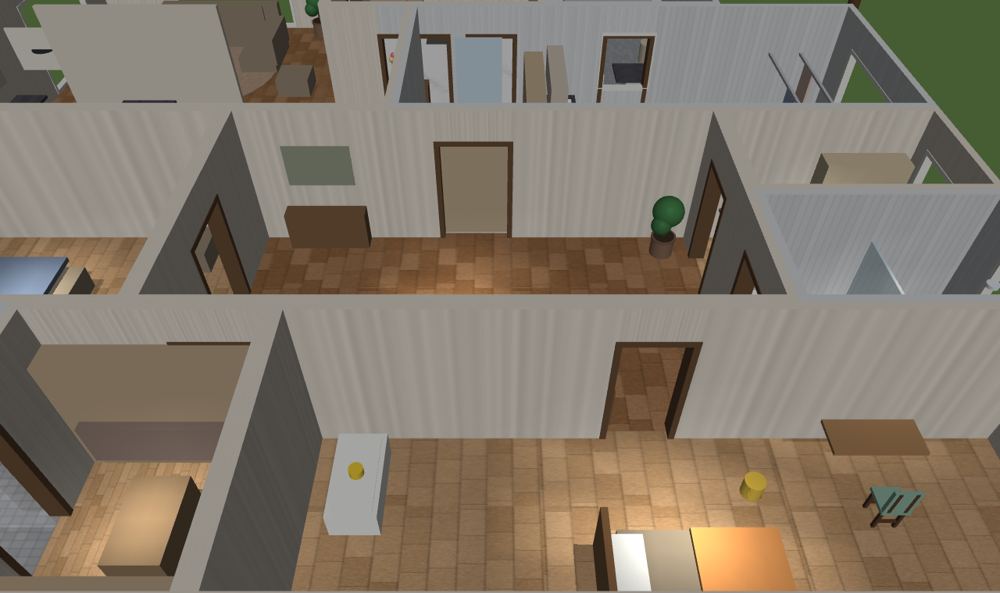

# Domus · 具身智能仿真场景资产库

**Domus**（拉丁语「宅邸」）是一套**程序化生成的室内仿真场景**，供机器人在里面感知、导航、干活。

命名接上现有的体系：**ANIMA**（拉丁 *anima*，灵魂 → 大脑）· **SOMA**（希腊 *soma*，身体）·
**DOMUS**（拉丁 *domus*，宅邸 → 它们所处的世界）。

场景编号沿用 CARLA 的 `Town01/Town02` 惯例：`Domus01`、`Domus02`……一个仓管全部，长期迭代。

---

## 现有场景

| 编号 | 户型 | 规模 | 说明 |
|---|---|---|---|
| **Domus01** | 大平层三室两厅双卫 | 12 个空间 / 364 ㎡ | 参照真实豪宅户型图复刻；客餐一体、主卧套间（衣帽间+主卫带独立浴缸）、中西厨分离 |

### Domus01 空间构成

主卫（独立浴缸）· 衣帽间 · 小孩房（含卫浴）· 主卧 · 过道 · 客卫 · 次卧 ·
餐厅（含西厨中岛）· 中厨（含晾晒）· 客厅 · 玄关 · 洗衣房

### 户型

关掉天花板俯视，可以看清整套动线：西侧是主卧套间与小孩房（静区），一条过道横贯东西，
东侧是客厅、玄关与服务区（动区）。




### 公共区

客厅与餐厅之间的墙整段拆除，电视立在原墙位置当软隔断——大平层的客餐一体做法。

| 客餐打通 | 客厅与电视墙 |
|---|---|
|  |  |

### 居室与服务区

| 主卧 | 主卫（独立浴缸） |
|---|---|
|  |  |

| 小孩房 | 中厨 |
|---|---|
|  |  |



### 机器人视角

这才是场景真正要服务的东西——四足机器狗的头部前视相机看到的画面。相机高度约 0.5 m，
所以房间的识别特征必须铺在这个高度带上。窗外能看到城市，天花板挡住天空。

| 出生在玄关 | 客厅（看电视墙） | 窗外城市 |
|---|---|---|
|  |  |  |

---

## 设计原则

**几何不手写，全部由布局定义生成。** 改屋子只改 `layout.py`，重跑生成器即可——
场景与消费方（世界服务判断「机器人在哪间屋」）读同一份真相源，不会两处坐标打架。

**⛔ 按真实做，不为某一种机器人定制。** 场景是「现实」，不是给某台机器的考题。
四足机器狗的相机只有 ~0.5 m 高，人形是 1.5 m 以上——**为了迁就狗去压低家具，
换成人形就全得重做**。看不见高处是**机器人侧**的局限，该用环视、抬头、换机位去解决，
不是把抽油烟机装到膝盖上。

> 这条是纠正来的。早期版本这里写的是「识别特征必须铺在 0.3–0.9 m 高度带」——那是
> 拿一台特定机器人的视角当设计目标，方向错了（Jeff 2026-07-25 校正）。

**摆位要真实：沿墙布置，中间留通行区。** 真实住宅的橱柜、衣柜是贴着墙走的，屋子中间是人
走路的地方。**别让大件家具横在房间中央**——2026-07-25 实测踩过：12 空间合并时鞋帽间的
整墙柜留在了中厨正中（还堵着门），把 45 ㎡ 的房间切成三块、只靠 54 cm 和 90 cm 两条缝
连通，机器狗进去就卡死。真实厨房重排之后，问题自然消失。

顺带说明：真实厨房里烤箱、洗碗机**本来就嵌在台面下**（0.1–0.9 m），冰箱本来就落地——
它们恰好落在低视角能看到的位置，这是真实的结果，不是为谁让步。

**家具是组合件，不是基本体。** 一把椅子 = 座面 + 靠背 + 两根竖档 + 四条腿 + 前后横撑；
一盏落地灯 = 配重底盘 + 细杆 + 收口 + 灯罩 + 收头。见 `domus01/furniture.py`。

**封顶。** 有天花板，机器人抬头看到的是屋顶不是天空；天花板单独归一个 geom group，
出俯视图时整层关掉即可。

**窗外有世界。** 近处树木草地 → 中景楼房 → 远处城市天际线背景板（matte painting 手法）。

---

## 目录结构

```
domus01/          场景本体
  layout.py         ⭐ 布局单一真相源（房间矩形/门窗/家具/窗外景物）
  furniture.py      参数化家具构件库（椅子/桌子/灯具/花瓶/绿植…）
  make_textures.py  程序化生成贴图（木地板/瓷砖/大理石/地毯/织物/城市天际线/挂画）
  make_house.py     布局 → house.xml（MJCF）
  house.xml         生成产物
  textures/         生成的贴图
robots/go2/       宇树 Go2 模型（含头部前视相机）
policies/         训练好的运动策略（ONNX + 契约）
```

## 重新生成场景

```bash
cd domus01
python make_textures.py     # 贴图（改了纹理才需要重跑）
python make_house.py        # 布局 → house.xml
```

依赖：`mujoco` · `numpy` · `pillow`

## 加一个新场景

复制 `domus01/` 为 `domus02/`，改 `layout.py` 里的房间矩形、门窗、家具即可。
生成器和构件库直接复用，不用动。

---

## 版本

见 [CHANGELOG.md](CHANGELOG.md)。当前 **v0.1**。

## 许可

私有仓。Go2 机器人模型来自 [MuJoCo Menagerie](https://github.com/google-deepmind/mujoco_menagerie)，
许可见 `robots/go2/GO2_MODEL_LICENSE`。
