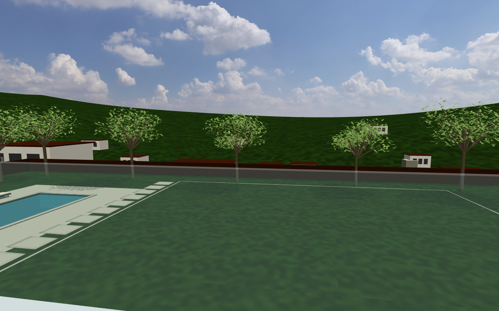
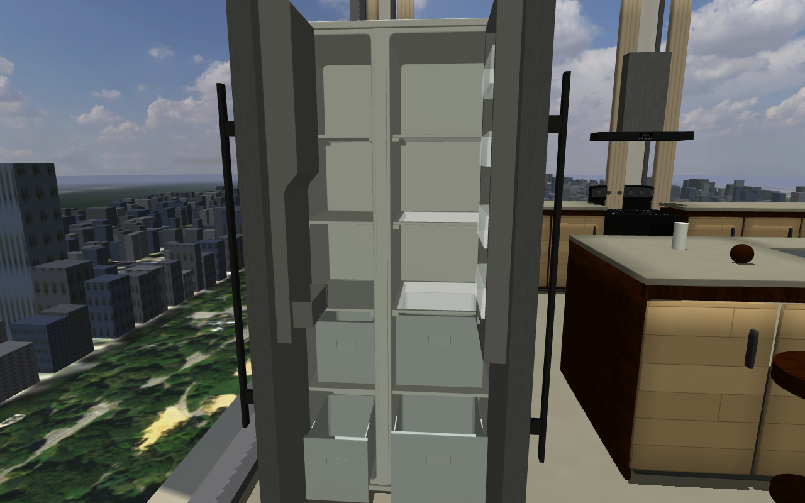
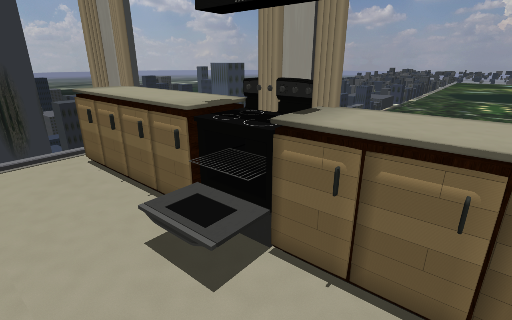
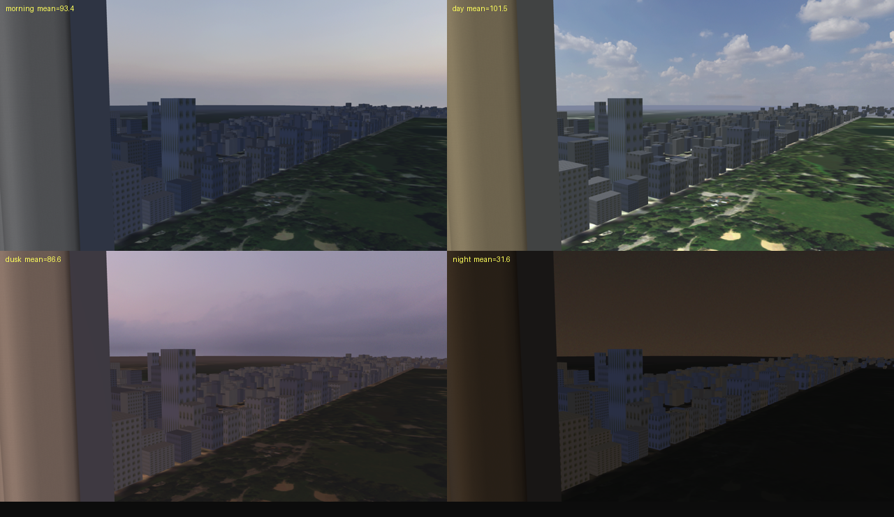

# nerv-world

[](LICENSE) [](https://mujoco.org)

[English](README.md) · [简体中文](README_zh.md)

Residential environments for MuJoCo and [NERV](https://github.com/Yanshi-Robotics/nerv),
with Unitree G1 and Go2 variants. Layout definitions generate the architecture, furniture,
collision geometry and robot scenes. Screenshots below come from MuJoCo's native renderer.


[Scenes](#scenes) · [Quick Start](#quick-start) · [Interactive furniture](docs/interactions/README.md) · [Residence guide](docs/residences/README.md)

**AI agents:** read [AGENTS.md](AGENTS.md) before changing the repository.

## Scenes

| Scene | Setting | Main purpose |
|---|---|---|
| [house1](#house1) | Single floor, 12 spaces, approximately 364 m² | Reference for navigation and room recognition |
| [house2](#house2) | Three-storey California mansion on an 80 × 70 m property | Indoor–outdoor navigation, stairs, garden and pool boundaries |
| [apt1](#apt1) | Manhattan apartment on floor 62, 13 spaces | Central Park views and four lighting presets |
| [apt2](#apt2) | Duplex on floors 62–63, 24 spaces | Detailed interiors, physical furniture and operator interaction |

house1 and apt1 are preserved reference scenes. Current residential development focuses on
house2 and apt2; these are also the two residential worlds registered with NERV.

### house1

The original single-floor reference: three bedrooms, connected living and dining areas,
a primary suite with dressing room and bathroom, separate Chinese and western kitchen areas,
an entrance and laundry. Its flat circulation routes support navigation and room recognition.

| Floor plan | Open living and dining area |
|---|---|
|  |  |

[house1 source](scenes/house1/layout.py) · [Remaining house1 pictures](docs/images/house1)

### house2

The newly developed California hillside mansion has three stepped floors, warm plaster,
stone and timber finishes, terraces and a furnished interior. An approximately 30 × 25 m
lawn and 15 × 6 m pool sit below the house, with a driveway, paths, trees and planting beds.

The entrance stays open. Continuous traversable routes connect the ground-floor robot room,
the house, the grounds and the closed outer gate. The gate and perimeter walls have continuous
collision geometry. The pool has a real basin and steps; its water surface does not support
weight. Roads, neighboring houses and descending hills form an inaccessible community backdrop.

| Lawn and house | Pool terrace |
|---|---|
|  |  |
| Living room | Hillside neighborhood |
|  |  |

[house2 layout](scenes/house2/layout.py) · [Estate definition](scenes/house2/estate.py) · [Gallery and reproduction](docs/residences/README.md)

### apt1

The single-floor Manhattan reference faces Central Park from approximately 232.5 m above
street level. The park imagery, surrounding building coordinates, visible host tower and
collidable windows establish the relationship between the apartment and the distant city.

Its **morning, day, dusk and night** presets change the sky, lights, facade appearance and
window materials. These are selectable lighting states; they do not simulate a running clock,
weather or seasonal changes. apt1's layout, assets and generated scenes remain preserved.


[apt1 source](scenes/apt1/layout.py) · [apt1 gallery](docs/images/apt1)

### apt2

apt2 extends the same Manhattan setting into a duplex with a double-height living room,
a two-flight staircase and an upper gallery. Pale oak, walnut, stone and linen finishes,
rounded upholstery, bedding, curtain folds, window reveals and cabinet details improve the
view at room scale and robot camera height.

| Double-height living room | G1 supported by the sofa |
|---|---|
|  |  |

| Compared with apt1 | What apt2 provides |
|---|---|
| Space | Two floors, double-height living room, upper gallery and connected staircase |
| Furniture collision | Decomposed chair, armchair and coffee-table shapes retain leg gaps; the sofa has a 0.35 m seat and a tested G1 seated pose |
| Kitchen | Four appliances with 22 passive joints: refrigerator doors and drawers, oven door and rack, knobs, faucet and hood buttons |
| Movable objects | Six dining chairs plus a can, fruit and book have mass, gravity and collision |
| Time presets | Morning, day, dusk and night use the shared city assets with apt2's own lighting; switching preserves furniture state |
| Inspection controls | Aim at nearby parts to operate them, adjust opening, move objects and release them into physics |

| Refrigerator open, drawers extended | Oven open, rack extended |
|---|---|
|  |  |



**Interaction scope:** furniture operations and time switching are available in the native
walkthrough inspector. NERV can load the passive furniture and run the G1 walking policy.
It does not yet expose furniture controls or autonomous G1 grasping, opening, sitting or
stair-climbing skills. The seated image is a pose settled in physics, not a sit-down policy.
Appliance controls move physically; water flow, heating, cooking and ventilation are not simulated.

[Interaction controls and capabilities](docs/interactions/README.md) · [apt2 layout](scenes/apt2/layout.py) · [Verification](docs/interactions/validation.md)

## Quick Start

Python 3.10 or later is required. From a standalone checkout:

```bash
git clone https://github.com/Yanshi-Robotics/nerv-world.git
cd nerv-world
python -m venv .venv
source .venv/bin/activate
pip install mujoco numpy pillow glfw
python tools/make_house.py --scene apt2
python tools/walkthrough.py --scene apt2 --robot g1
```

A fresh clone generates simplified furniture where downloaded meshes are unavailable.
The articulated appliances retain analytic collision bodies and joints in this mode.
To reproduce the detailed furniture, use the [asset setup](docs/interactions/README.md#asset-setup).
Do not open a downloaded generated XML before regenerating it for your local assets.

Walk with **WASD**, look with the mouse, jump with **Space**, and use **F** for inspection flight.
In apt2, aim within two metres: **E** operates a part, **[ / ]** adjusts its opening, **J** selects
another joint on the same part, **G** grabs/releases a movable object, **L** cycles time presets,
and **Backspace** resets furniture. **Esc** releases the mouse; **Q** exits.
This camera movement is an inspection tool, not robot locomotion.

Other scene and robot combinations use the same generator:

```bash
python tools/make_house.py --scene house2 --robot go2
python -m mujoco.viewer --mjcf=build/house2-go2.xml
python tools/check_scene.py --scene apt2
python tools/check_interactions.py
python tools/walkthrough.py --scene apt2 --selftest
python tools/check_residences.py
```

For NERV, this repository is the `worlds/` submodule. The descriptors in
[house2/world.yaml](house2/world.yaml) and [apt2/world.yaml](apt2/world.yaml) select the scene
and G1 body. Locomotion policies live in [nerv-policies](https://github.com/Yanshi-Robotics/nerv-policies),
not in this repository. See [NERV](https://github.com/Yanshi-Robotics/nerv) for its launcher.

## Development

Edit `scenes/<scene>/layout.py` and its supporting modules, then regenerate
`build/<scene>-<robot>.xml`. Never hand-edit the generated XML. Scene and robot manifests keep
the two selections independent. Downloaded assets and temporary outputs remain outside Git.

- [Residence geometry, rendering and NERV checks](docs/residences/README.md)
- [Interactive furniture architecture and next development steps](docs/interactions/README.md)
- [Changelog](CHANGELOG.md)

## License

Code and original procedural assets use the [MIT license](LICENSE). Third-party material
retains its own terms: [G1](robots/g1/G1_MODEL_LICENSE) and [Go2](robots/go2/GO2_MODEL_LICENSE)
models use BSD-3-Clause; furniture sources include Poly Haven CC0, Objaverse CC-BY-4.0 and
RoboCasa CC-BY-4.0. External furniture bytes are fetched locally and are not stored in Git.

See the [furniture attribution](decor/ATTRIBUTION.md), [city and texture attribution](textures/house3/ATTRIBUTION.md),
[residence asset record](docs/residences/assets.json) and [articulation source record](decor/articulation.lock.json)
for sources, licenses and hashes. Thanks to Unitree Robotics, Google DeepMind, the MuJoCo
and Menagerie maintainers, and the listed asset authors.
