[](README.md) [](README_zh.md)

# alice-house · A House for Robots to Live In

[](LICENSE) [](https://mujoco.org) [](https://www.python.org) [](CHANGELOG.md)

> 🤖 **If you are an AI agent, read [AGENTS.md](AGENTS.md) first** — the machine-facing entry point:
> what this repo is, where each fact lives, the entry commands, and the red lines.

**A procedurally generated indoor simulation scene, shipped with two Unitree robots and trained locomotion policies — clone it and they actually walk around the house.**

**Alice's house** — an indoor scene generated entirely from code, for robots to look around in, walk through, search, and work in.

Not one line of geometry is hand-written: rooms, doors, windows, furniture and textures all come out of a single layout definition (`layout.py`). Change the house by changing the layout and re-running the generator; the scene and whatever consumes it read the same source of truth, so coordinates can never disagree in two places.

It also ships **robots** (Unitree Go2 quadruped, Unitree G1 humanoid) and their trained **locomotion policies** — so they really take steps, they don't teleport.

> Where the name comes from: Alice is robot number one in this series. This is her house.
> It may grow into an island one day — house, hillside trail, dock — with Alice visiting each.

---

## Table of Contents

- [What's Inside](#whats-inside) · [Robots](#robots) · [Floor Plan & Screenshots](#floor-plan)
- [Design Principles](#design-principles)
- [Project Structure](#project-structure)
- [Quick Start](#quick-start)
- [One Scene per Robot](#one-scene-per-robot)
- [Versioning](#versioning) · [License](#license)

---

## What's Inside

| Layout | Size | Notes |
|---|---|---|
| 3 bedrooms, 2 living areas, 2 baths (single floor) | 12 spaces / 364 m² | Modelled after a real floor plan: open living-dining, master suite (walk-in closet + ensuite with freestanding tub), separate wet/dry kitchens |

### Robots

| Key | Body | Eye height | Notes |
|---|---|---|---|
| **go2** | Unitree Go2 quadruped | ~0.38 m | Head-mounted forward camera; flat-ground velocity policy |
| **g1** | Unitree G1 humanoid (29 dof) | ~1.25 m | 1.38 m standing; head camera on the torso, pitched 10° down |

The same room looks very different through these two pairs of eyes — which is exactly why the scene is **built to be realistic, not tailored to one robot**.

### Spaces

Master bath (freestanding tub) · walk-in closet · kid's room (ensuite) · master bedroom ·
corridor · guest bath · second bedroom · dining room (with a western-kitchen island) ·
Chinese kitchen (with drying area) · living room · entry hall · laundry

### Floor Plan

Ceiling hidden, viewed from above — you can read the whole circulation: the master suite and
kid's room (quiet zone) sit west, a corridor runs east-west, and the living room, entry and
service rooms (active zone) sit east.

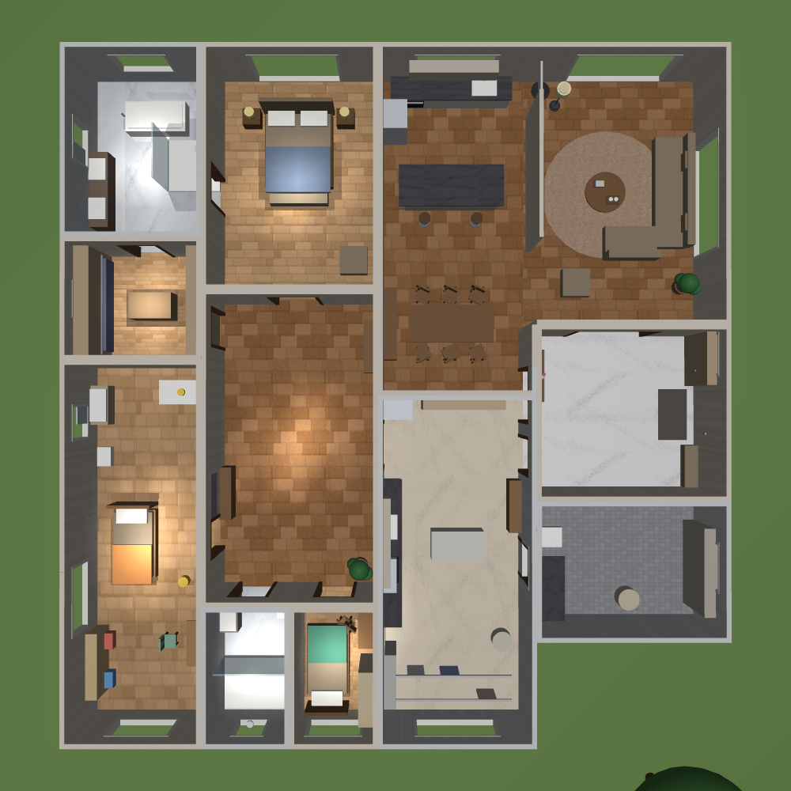

### Common Areas

The wall between living and dining is removed entirely; the TV stands where that wall used to be
and acts as a soft divider — the way open-plan apartments usually do it.

| Living-dining opened up | Living room |
|---|---|
| 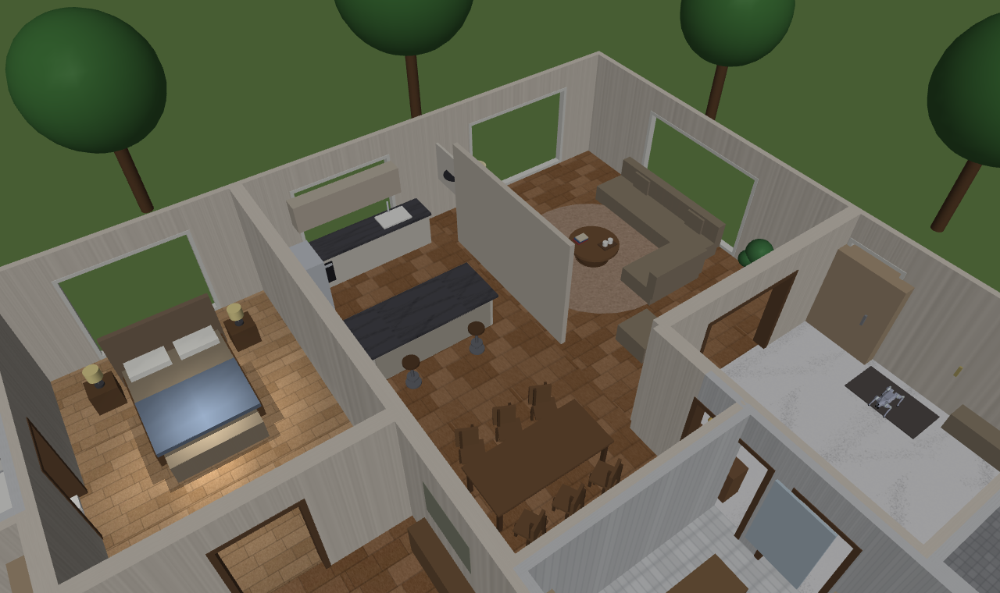 | 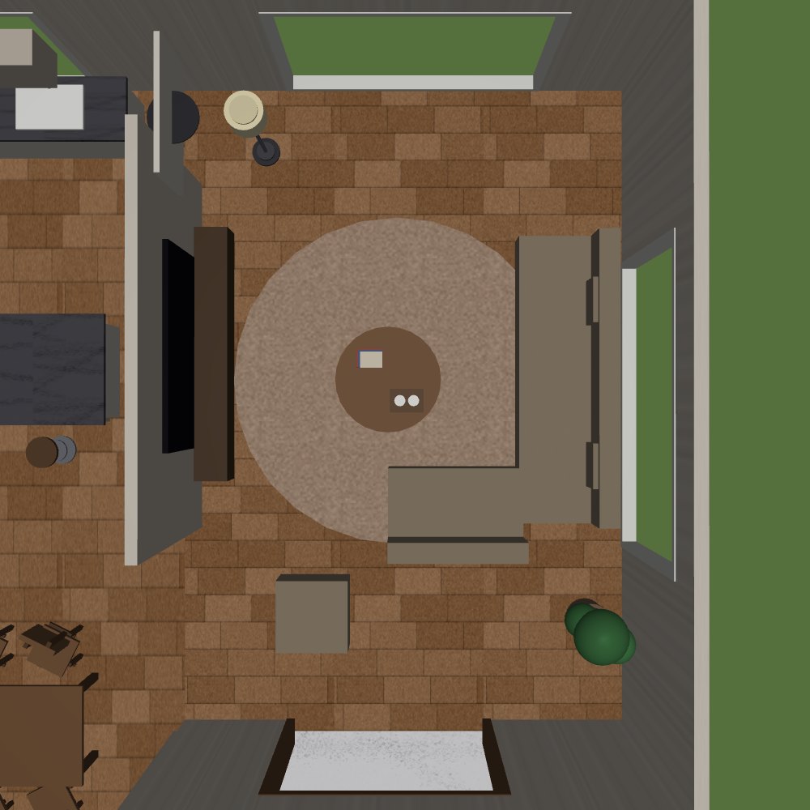 |

### Bedrooms & Service Rooms

| Master bedroom | Master bath (freestanding tub) |
|---|---|
| 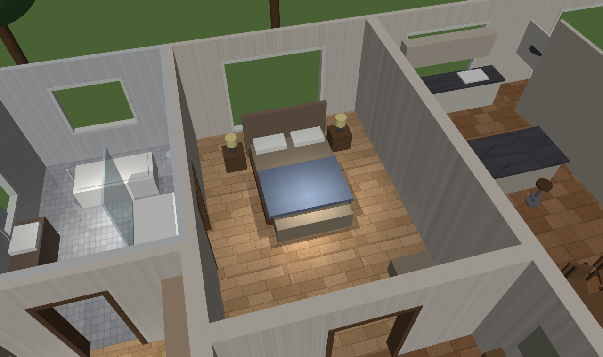 | 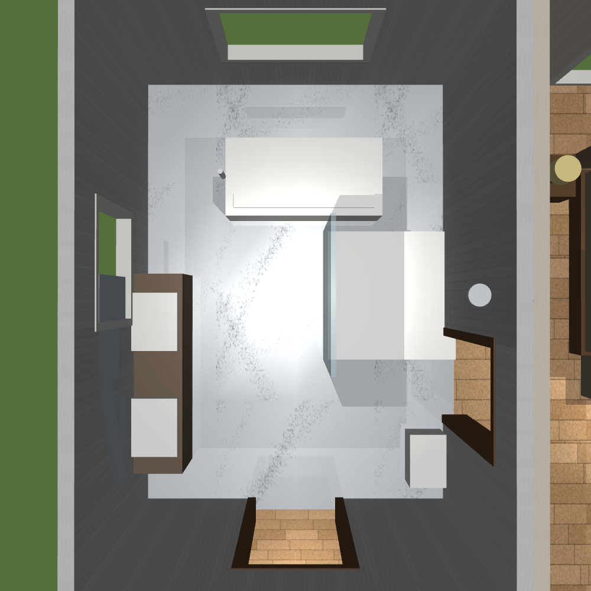 |

| Kid's room | Chinese kitchen |
|---|---|
| 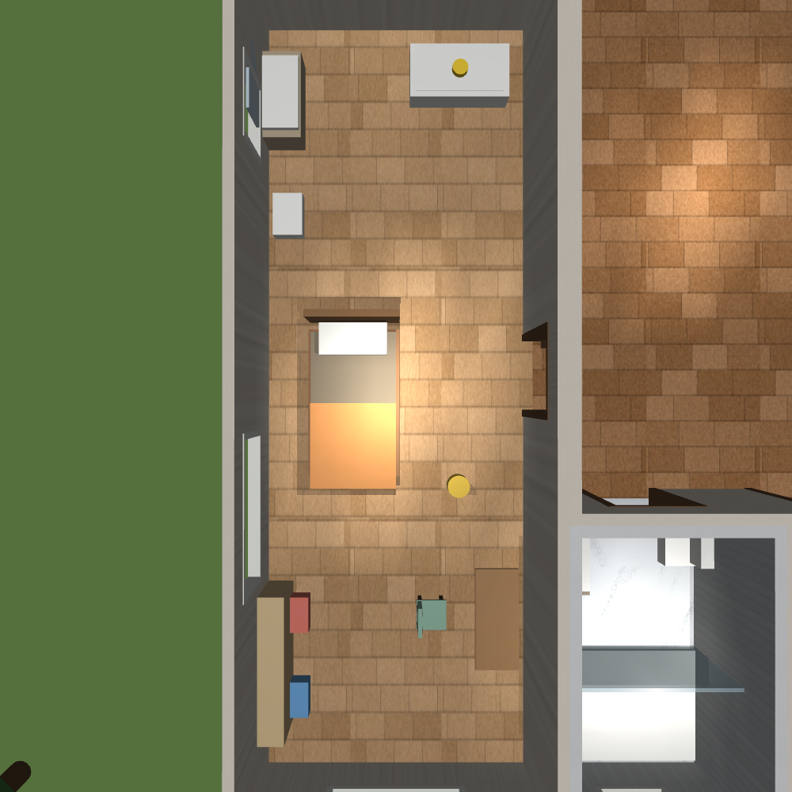 | 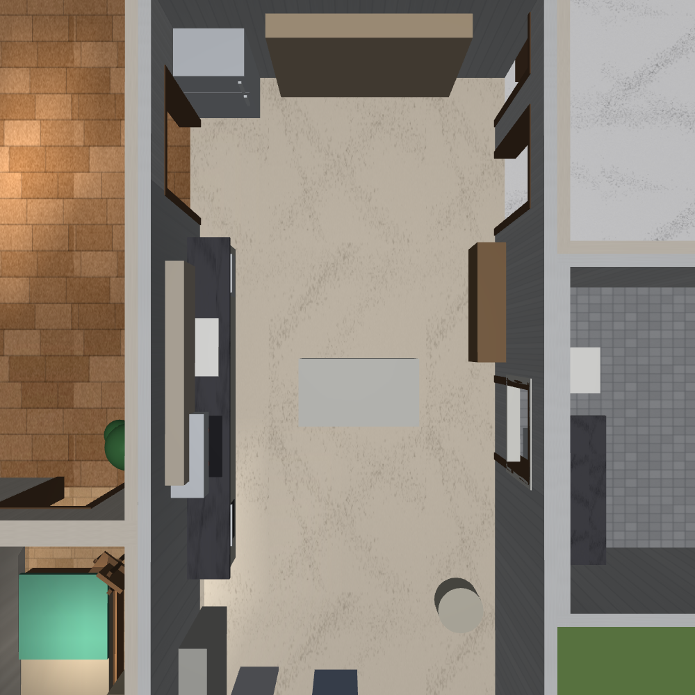 |

The kitchen shot is worth a second look: the counter run goes along the west wall
(dishwasher · sink · stove · oven), tall storage and the fridge sit against the north wall,
and the middle is left clear to walk through. **This was re-laid out on 2026-07-25** — before
that, a full-height cabinet wall sat in the middle of the room and blocked a door, cutting
45 m² into three pieces; the robot dog would crawl into a 54 cm gap and get stuck.

### Through the Robot's Eyes

What this scene ultimately serves is a robot's camera. The shots below are from the
**quadruped's head camera** (0.38 m); the last one is the same kitchen at **humanoid eye
height** (1.25 m, the G1's actual camera height) for comparison.

| Spawned in the entry | Living room (facing the TV wall) | Corridor |
|---|---|---|
| 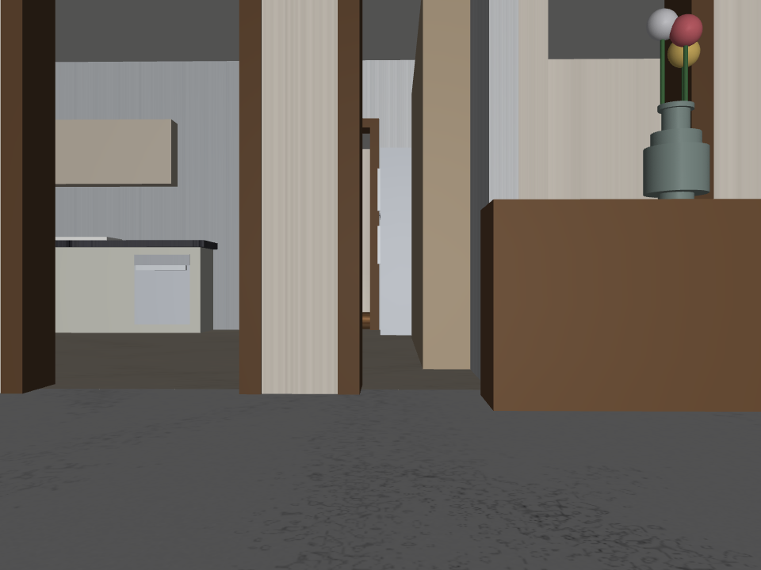 | 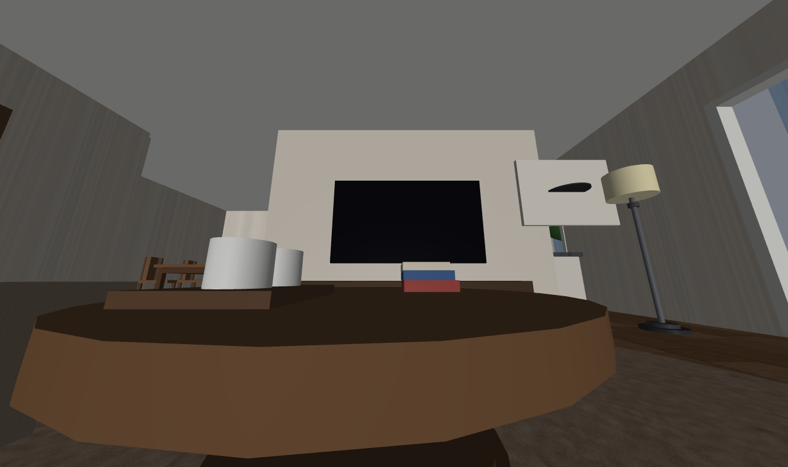 |  |

| Looking into the kitchen from the door | The city outside | Same kitchen, humanoid eye height |
|---|---|---|
| 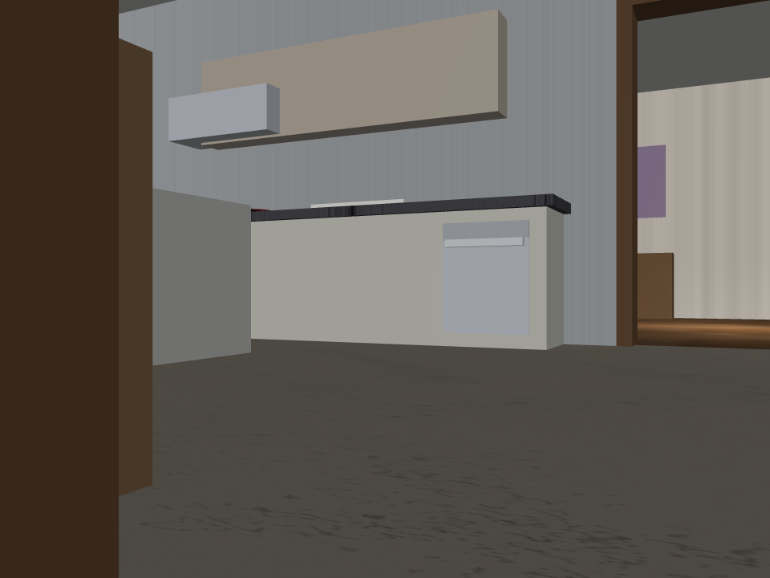 | 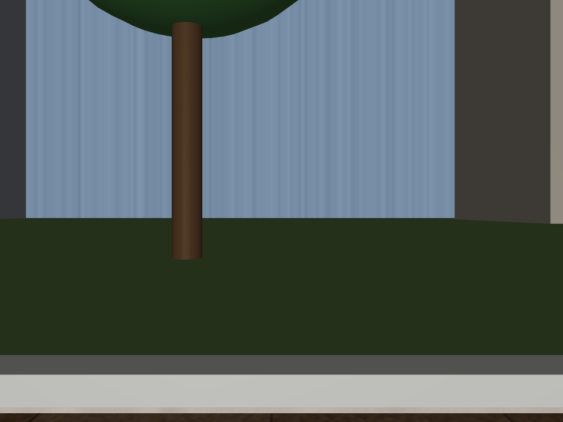 |  |

### How the Screenshots Are Made

**Don't hand-capture them.** Every camera pose lives in `make_docs_images.py`; re-run it
whenever the scene changes:

```bash
python make_docs_images.py        # all of them
python make_docs_images.py E1 G3  # only the ones you name
```

Background: the first set of screenshots was framed by hand one at a time. One kitchen
re-layout later they were all stale, and nobody remembered where the cameras had been.

---

## Design Principles

**No hand-written geometry — everything is generated from the layout definition.** Change the
house by changing `layout.py` and re-running the generator. The scene and its consumers (e.g. a
world service deciding "which room is the robot in") read the same source of truth.

**⛔ Build for realism, not for one particular robot.** The scene is *reality*, not an exam paper
written for one machine. A quadruped's camera sits around 0.4 m; a humanoid's is above 1.2 m —
**lower the furniture to suit the dog and you have to redo everything when the humanoid arrives.**
Not being able to see high things is a limitation *on the robot side*, to be solved by looking
around, looking up, or moving — not by mounting the range hood at knee height.

> This principle is a correction. An earlier version said "recognisable features must sit in the
> 0.3–0.9 m band" — that was taking one specific robot's viewpoint as the design target.

**Place things the way they really are: along the walls, keep the middle clear.** In real homes
cabinets and wardrobes hug the walls and the middle of the room is where people walk. **Don't
leave a large piece of furniture stranded in the middle of a room** — measured the hard way on
2026-07-25: a full-height cabinet left in the middle of the kitchen cut a 45 m² room into three
pieces connected only by a 54 cm and a 90 cm gap, and the robot got wedged.

Worth noting: in a real kitchen the oven and dishwasher **are** built in under the counter
(0.1–0.9 m) and the fridge **does** stand on the floor — they happen to land where a low camera
can see them. That is a consequence of realism, not a concession to anyone.

**Furniture is assembled from parts, not primitives.** A chair = seat + back + two stiles + four
legs + front and rear rails; a floor lamp = weighted base + slim pole + collar + shade + finial.
See `furniture.py`.

**Capped.** There is a ceiling — look up and you see a roof, not sky. The ceiling lives in its own
geom group so it can be switched off in one line for top-down renders.

**There's a world outside the windows.** Near trees and grass → mid-ground buildings → a distant
city skyline backdrop (matte-painting style).

---

## Project Structure

```
layout.py           ⭐ single source of truth for the layout (room rects / doors / windows / furniture / outdoor scenery)
furniture.py        parametric furniture part library (chairs / tables / lamps / vases / plants…)
make_textures.py    procedural textures (wood floor / tile / marble / carpet / fabric / city skyline / wall art)
make_house.py       layout + robot → house-<robot>.xml (MJCF)
make_docs_images.py renders the README screenshots (poses live in code; one command re-renders)
house-go2.xml       generated scene (quadruped)
house-g1.xml        generated scene (humanoid)
textures/           generated textures
robots/
  manifest.py       ⭐ single source of truth for robots (model / spawn height / camera / policy / how torque is applied)
  go2/              Unitree Go2 model (with head camera)
  g1/               Unitree G1 humanoid, 29 dof (imported from Menagerie by import_from_menagerie.py)
policies/           trained locomotion policies (ONNX + contract)
docs/images/        README screenshots
```

## Quick Start

```bash
git clone https://github.com/jeffliulab/alice-house.git
cd alice-house
pip install mujoco numpy pillow

# Take a look at the house (scenes are already generated — just open them)
python -m mujoco.viewer --mjcf=house-go2.xml     # with the quadruped
python -m mujoco.viewer --mjcf=house-g1.xml      # with the humanoid
```

Re-generate after changing the house:

```bash
python make_textures.py         # textures (only needed if you changed them)
python make_house.py            # one scene per robot
python make_house.py --robot g1 # humanoid only
python make_docs_images.py      # re-render the README screenshots
```

To actually **make a robot walk**: `policies/` holds trained ONNX policies with a
`contract.json` next to each (joint order, gains, observation layout — all of it). Feed a policy
a velocity command `(vx, vy, wz)` and it returns joint targets. For a working deployer, see
`world/sim-house-nav/sim.py` in [anima-zero](https://github.com/jeffliulab/anima-zero).

## One Scene per Robot

`house-go2.xml` and `house-g1.xml` are the same house with a different occupant. Why not one
file: a robot's mesh path is baked in at MJCF compile time, so two robots can't share a model.

**`robots/manifest.py` is the single source of truth for "what this robot is"** — where the model
lives, how high it spawns, what the camera is called, how torque is applied. Adding a robot means
appending one entry and re-running the generator.

⚠️ The manifest deliberately **does not repeat** anything already in the policy contract
(`contract.json`: joint order, gains, observation layout, control period). The contract is the
source of truth for those; copying them would guarantee they drift apart.

⛔ **The two robots apply torque in opposite ways** — recorded as `pd_mode` in the manifest, and
getting it backwards makes the robot fall over immediately. The Go2 was trained with explicit PD
(the deployer computes `−kd·qd` itself and zeroes the model's damping); the G1 with implicit PD
(`kd` goes into `dof_damping` for MuJoCo to apply, and the torque carries only the `kp` term).

## Changing the House / Adding New Places

Edit the room rectangles, doors, windows and furniture in `layout.py` and re-run the generator.
The part libraries (furniture, textures) are reused as-is. Adding a **different place** (a hillside
trail, a dock…) works the same way: write another layout definition; the generator doesn't change.

---

## Versioning

See [CHANGELOG.md](CHANGELOG.md). Currently **v0.4**.

## License

The scene generator, furniture and texture libraries, robot manifest, locomotion policies and
documentation in this repository are **MIT** licensed (see [LICENSE](LICENSE)).

Third-party assets bundled here keep their own licenses: the Unitree Go2 and G1 models come from
[MuJoCo Menagerie](https://github.com/google-deepmind/mujoco_menagerie) under BSD-3-Clause — see
`robots/go2/GO2_MODEL_LICENSE` and `robots/g1/G1_MODEL_LICENSE`. What we changed in the G1 model
and why is written up in `robots/g1/G1_MODEL_UPSTREAM.md`.

## Acknowledgments

Unitree Robotics for the Go2 and G1 models · Google DeepMind for
[MuJoCo](https://mujoco.org) and [Menagerie](https://github.com/google-deepmind/mujoco_menagerie).
