# nerv-world

[](LICENSE) [](https://mujoco.org)

[English](README.md) · [简体中文](README_zh.md)

面向 MuJoCo 和 [NERV](https://github.com/Yanshi-Robotics/nerv) 的住宅场景库，提供宇树 G1 和 Go2 版本。
建筑、家具、碰撞体和机器人场景均由布局定义生成。MuJoCo 原生截图呈现仿真场景，
World Explore 配图则来自独立的 Three.js 浏览器导览。

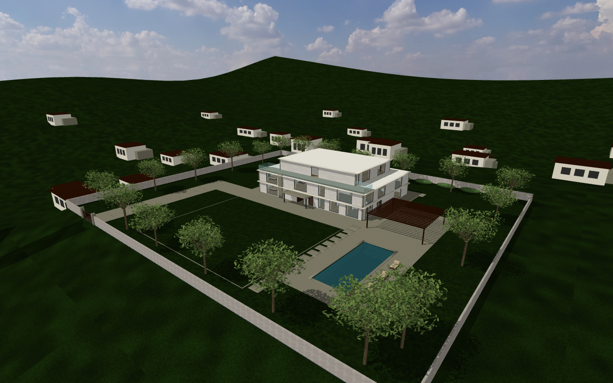

[场景](#场景) · [快速开始](#快速开始) · [三维导览](#三维导览) · [可交互家具](docs/interactions/README.md) · [住宅指南](docs/residences/README.md)

**AI agent**：修改仓库前请阅读 [AGENTS.md](AGENTS.md)。

## 场景

| 场景 | 空间 | 主要用途 |
|---|---|---|
| [apt](#apt) | 曼哈顿 62—63 层复式，24 个空间 | 中央公园窗景、四时段氛围、真实家具碰撞与操作者交互 |
| [house](#house) | 三层加州山坡豪宅，宅地约 80 × 70 m | 四时段光照、庭院路线、草坪、泳池和封闭宅地 |

本仓维护这两张住宅地图。apt 结合原复式的交互能力与原单层公寓的城市环境和时段效果；house 延续山坡豪宅。
旧编号地图已退役，历史版本可按[迁移说明](docs/residences/migration/README.md)恢复。

### apt

apt 在同一曼哈顿环境中扩展为两层复式，增加双高客厅、双跑楼梯和上层环廊。
浅橡木、胡桃木、石材与亚麻布艺形成室内材质体系，软包收边、床品、窗帘褶皱、窗洞进深及柜门细节改善了近距离观感。

| 双高客厅 | 沙发承托 G1 的坐姿 |
|---|---|
| 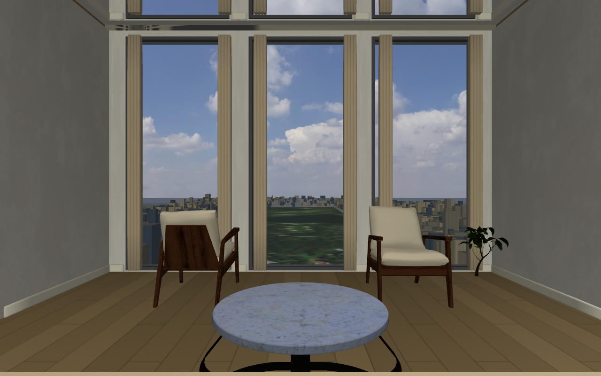 | 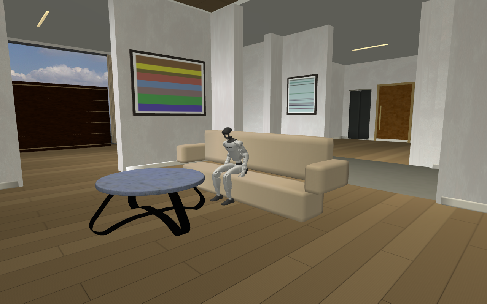 |

| 能力 | apt 的实现 |
|---|---|
| 空间 | 两层复式、双高客厅、上层环廊与连续楼梯 |
| 家具碰撞 | 餐椅、单椅、茶几采用凸分解碰撞，保留腿部空隙；沙发座面为 0.35 m，具有经过物理验证的 G1 坐姿 |
| 厨房 | 四件电器具有 22 个被动关节，覆盖冰箱门与抽屉、烤箱门与烤架、旋钮、龙头及烟机按钮 |
| 可移动物体 | 六把餐椅以及罐子、水果、书具有质量、重力和碰撞 |
| 时段 | 保留早晨、白天、黄昏、夜晚，复用城市资产并单独配置室内灯光；切换不会重置家具状态 |
| 操作者控制 | NERV 场景测试和原生检查器可操作附近部件、调整开度，抓取物体并松手让其参与物理运动 |

| 冰箱开门、抽屉拉出 | 烤箱开门、烤架拉出 |
|---|---|
| 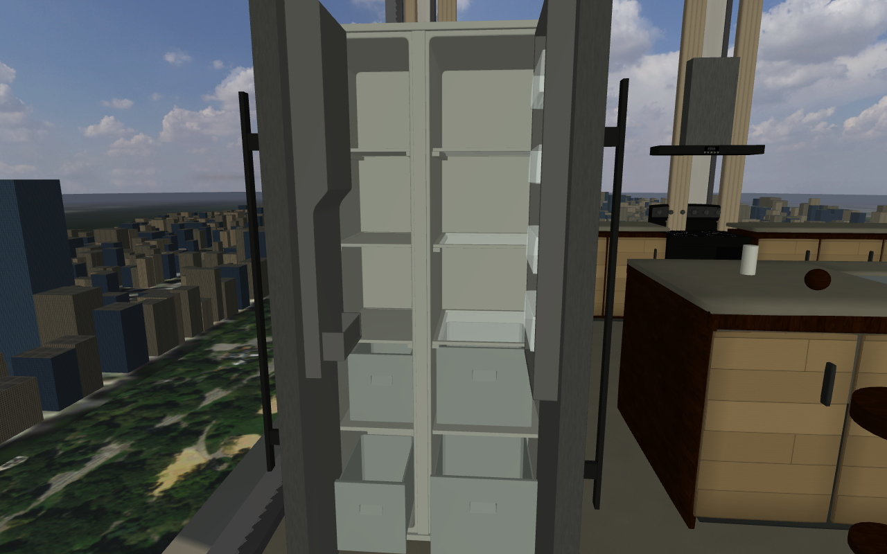 | 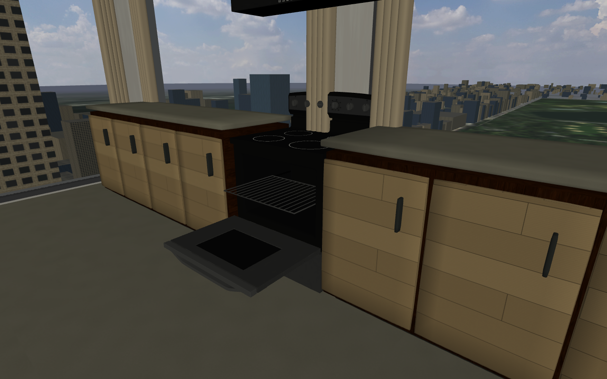 |

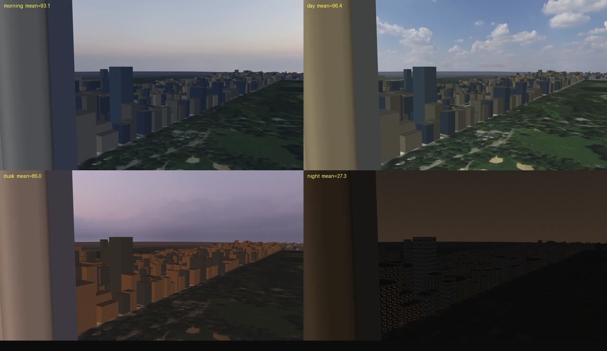

NERV 的**场景测试**面板已接入 22 个电器关节和九个可移动物体，通过受限物理力操作家具，并显示实际运动与碰撞反馈。
进入测试前，系统取得独占控制租约，让机器人停止并解除武装；测试结束后，需要操作者重新武装才能恢复普通机器人命令。
选取范围限于操作员相机两米内的可见表面，墙壁和关闭的门会遮挡选取。取消操作或租约到期会清除交互施力。

冰箱任务要求罐子整体进入右侧冷藏室标出的中层目标区域，松手后由指定搁板稳定承托，再关闭冰箱门。
任务根据几何范围、实际运动和真实接触判定，抓住罐子悬停在目标内不能完成任务。
物理重复测试、浏览器操作及中断检查见 [NERV 运行验收](https://github.com/Yanshi-Robotics/nerv/tree/main/docs/validation/world-explore)。

原生漫游仍保留独立的检查器操作。已发布的 G1 策略提供行走和转向；自主抓取、开门、坐下和上下楼梯需要额外的机器人技能。
坐姿配图来自真实物理沉降，不代表自主坐下策略。
电器控制部件可以运动，但水流、加热、烹饪及通风尚未模拟。

[操作方法与能力说明](docs/interactions/README.md) · [apt 布局](scenes/apt/layout.py) · [验证记录](docs/residences/migration/validation.md)


公寓保留约 232.5 m 的标高、中央公园航拍、根据 NYC 建筑轮廓和高度数据生成的 2716 个建筑体块和 12 栋补充地标，
以及本楼立面、可碰撞落地玻璃和真实的窗景视差。八幅挂画按复式实墙重新布置；衣帽间、储物柜、
洗衣机与烘干机、两间卫浴的坐便器和镜子，以及主卫的中空浴缸和淋浴区补齐各房间的用途。
这些新增设施均为静态模型；可以操作的厨房设备以上表为准。
玄关的私人电梯门为固定建筑构件，不提供电梯运行功能。

| 时段 | 主要观感 |
|---|---|
| 早晨 | 偏冷的天空和环境光，东侧低角度暖光进入室内 |
| 白天 | 明亮的公园、清晰的城市立面和自然室内光照 |
| 黄昏 | 西侧暖光，上西区和上东区呈现不同的冷暖色调 |
| 夜晚 | 点亮的城市窗格、压暗的公园与本楼立面，室内保留暖光和地面可见度 |

这些是可选择的时段预设，不包含连续时钟、天气或季节模拟。可在 NERV 中选择时段，或在原生漫游中按 **L** 切换，
家具的开合、位置和速度保持不变。

| 左侧窗景 | 向右横移约 3.67 m 后的同向窗景 |
|---|---|
|  | 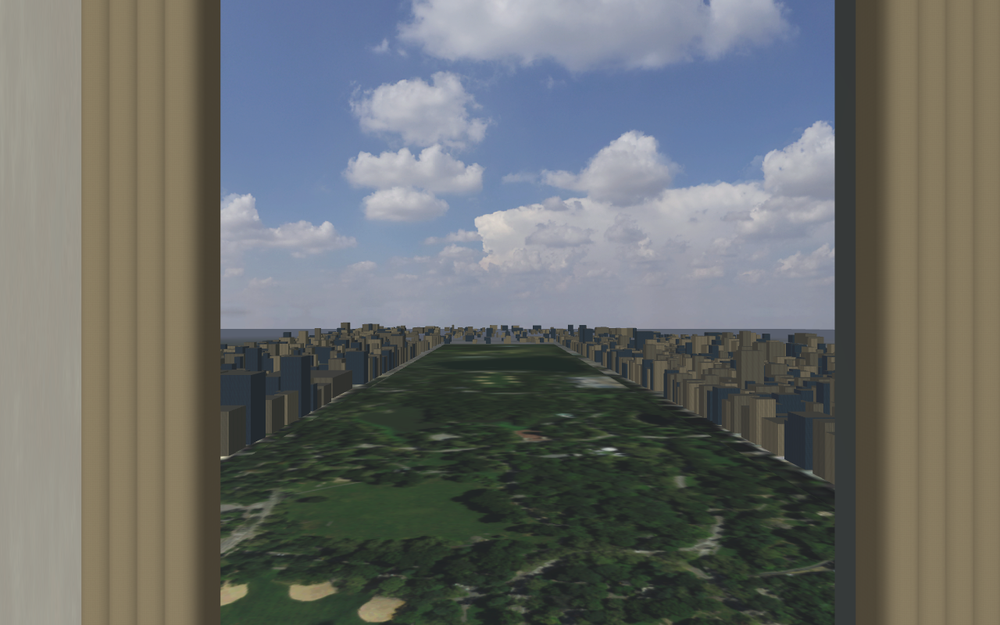 |

### house

新开发的加州山坡豪宅采用三层退台体量，配有露台和完整室内陈设，以暖白灰泥、浅色石材和木饰面构成建筑外观。
主楼前方设约 30 × 25 m 草坪和 15 × 6 m 泳池，并以车道、步道、树木和花池连接庭院各区。

入户门固定敞开。一层停机房、住宅、庭院和关闭的外大门之间具有连续可通行路线。
大门与外围围墙具有连续碰撞。泳池具有真实池壁、池底与台阶，水面不承重；道路、邻宅与下降的山坡构成不可进入的社区远景。
布局定义了通往大门、草坪、泳池的检查路线，以及绕池、侧院和后庭路线。对于使用平地步态的 G1，楼梯入口是停止检查点。

NERV 与原生漫游均可选择早晨、白天、黄昏和夜晚。夜间灯光覆盖入口、大门、西侧步道与池畔，同时保留深色天空。
时段切换只改变光照，不会重置机器人或家具。

| 草坪与主楼 | 泳池露台 |
|---|---|
| 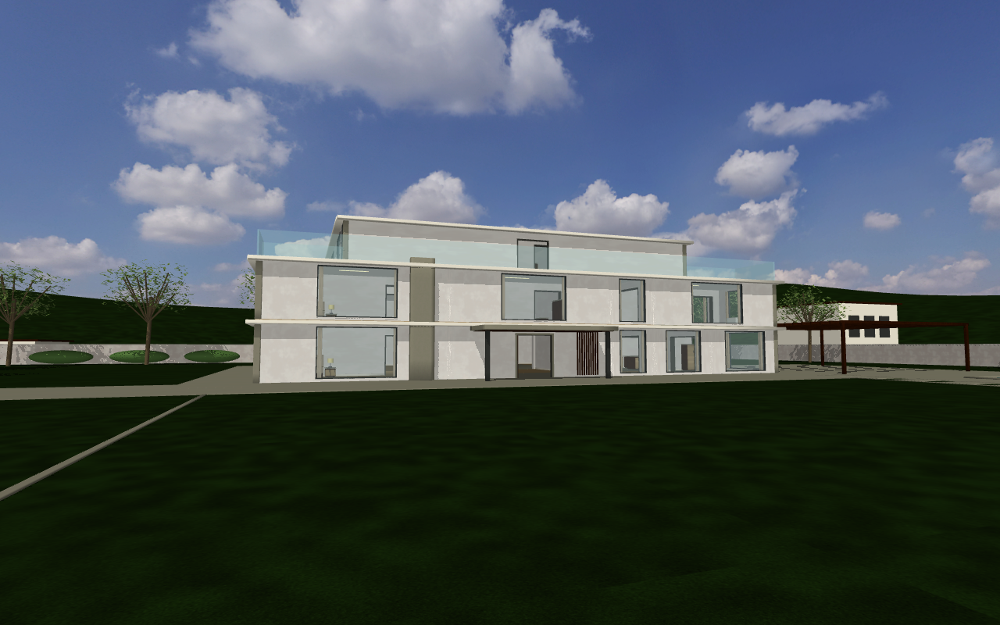 | 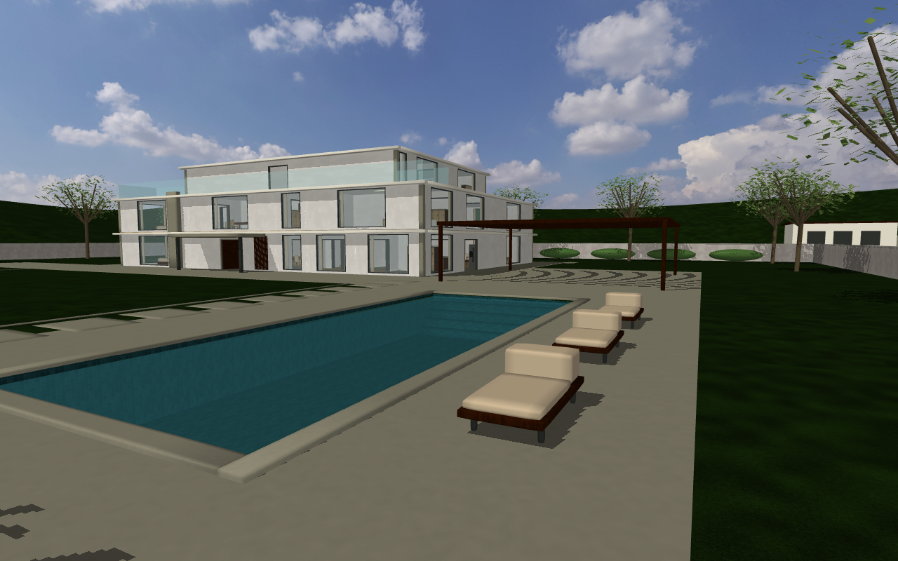 |
| 客厅 | 山坡社区 |
| 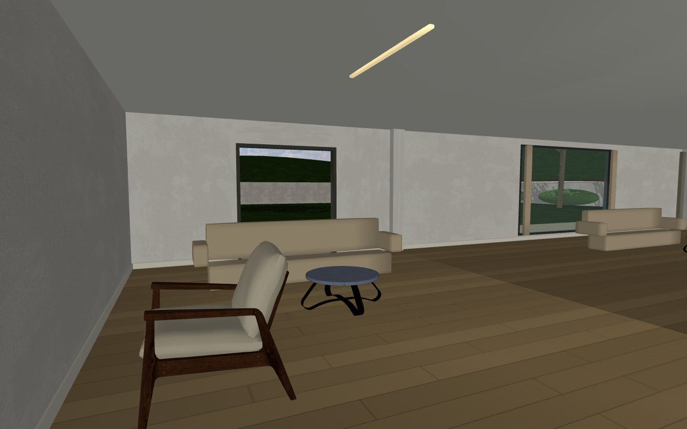 | 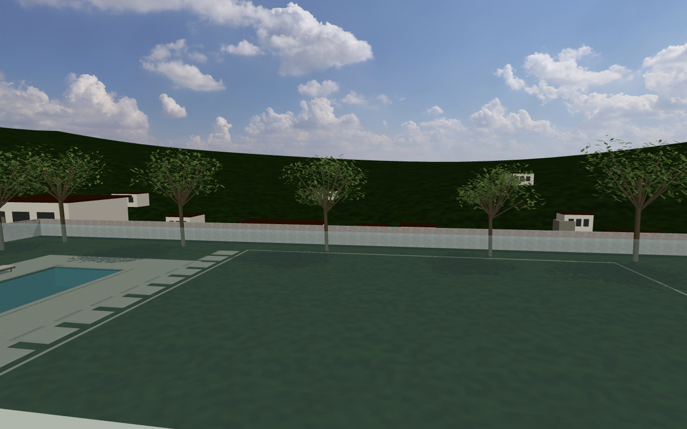 |

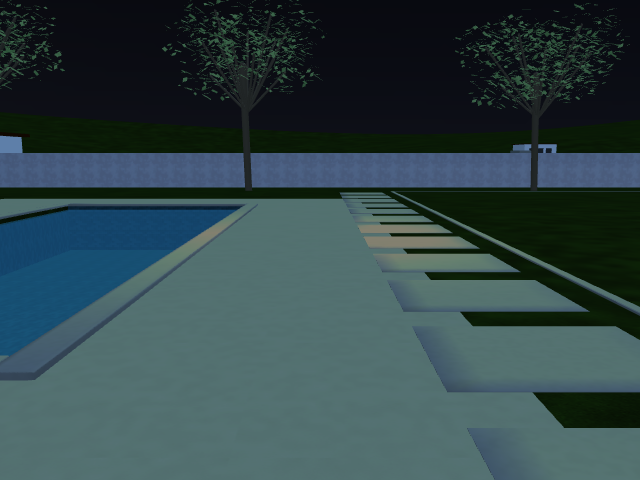

西侧池畔夜景，来自 MuJoCo 原生渲染器。

[house 布局](scenes/house/layout.py) · [宅地定义](scenes/house/estate.py) · [配图与复现](docs/residences/README.md)

## 快速开始

需要 Python 3.10 或更新版本。独立下载场景库后运行：

```bash
git clone https://github.com/Yanshi-Robotics/nerv-world.git
cd nerv-world
python -m venv .venv
source .venv/bin/activate
pip install mujoco numpy pillow glfw
python tools/make_house.py --scene apt
python tools/walkthrough.py --scene apt --robot g1
```

首次下载时，尚未取得的家具网格会由简化几何代替。关节电器在此模式下仍保留基本体碰撞和关节。
复现完整家具请按[资产准备说明](docs/interactions/README.md#asset-setup)操作。
应先按本机可用资产重新生成场景，再打开对应 XML。

**WASD** 行走，鼠标转向，**空格**跳跃，**F** 切换检查器飞行。
在 apt 中瞄准两米内的部件：**E** 开合或按压，**[ / ]** 调整开度，**J** 切换同一部件的其他关节，
**G** 抓取或松手，**L** 切换时段，**Backspace** 复位家具。**Esc** 释放鼠标，**Q** 退出。
这里移动的是检查视角，不是机器人的步态控制。

其他场景与机器人组合使用同一生成器：

```bash
python tools/make_house.py --scene house --robot go2
python -m mujoco.viewer --mjcf=build/house-go2.xml
python tools/check_scene.py --scene apt
python tools/check_interactions.py
python tools/walkthrough.py --scene apt --selftest
python tools/check_residences.py
```

在 NERV 中，本仓库位于 `worlds/` 子模块。[house/world.yaml](house/world.yaml) 和 [apt/world.yaml](apt/world.yaml)
定义场景与 G1 身体的组合。行走策略由独立的 [nerv-policies](https://github.com/Yanshi-Robotics/nerv-policies) 提供；
启动方式见 [NERV](https://github.com/Yanshi-Robotics/nerv)。

## 三维导览

从 NERV 侧栏打开 **Nerv World Explore**，无需启动仿真即可查看两张地图。
Three.js 导览支持旋转、平移、缩放、楼层剖切、房间搜索、设施高亮及检查说明。
画面显示场景初始布局和白天材质；选择设施会定位视角，不会操作家具或改变正在运行的世界。
物理操作请使用活动仿真中的场景测试。


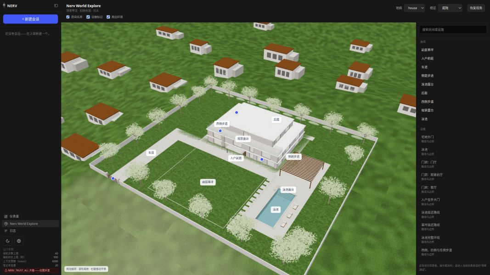

以上两张导览图来自浏览器，光照效果与原生相机不同。
完成[家具资产准备](docs/interactions/README.md#asset-setup)后，在本仓目录生成导览资源：

```bash
pip install -r requirements-explore.txt
python tools/make_house.py --scene apt
python tools/make_house.py --scene house
python tools/export_explore.py --scene apt
python tools/export_explore.py --scene house
python tools/check_explore.py
```

导出器将 `scene.glb` 和 `manifest.json` 写入 `.cache/explore/<scene>/`。
NERV 会核对源指纹和资源哈希；缺失、过期或被修改的导出会明确报错，场景源码或资产变化后应重新生成。
下载的家具和派生 GLB 均不进入 Git。详见[导出说明](docs/explore/README.md)和[场景库检查记录](docs/explore/verification/README.md)。

## 开发

修改 `scenes/<场景>/layout.py` 及其相关模块，再生成 `build/<场景>-<机器人>.xml`，不要手改生成文件。
场景清单和机器人清单相互独立，下载资产与临时产物不进入 Git。

- [住宅几何、配图与 NERV 检查](docs/residences/README.md)
- [家具交互结构与任务判定](docs/interactions/README.md)
- [NERV 交互、路线、相机与浏览器验收](https://github.com/Yanshi-Robotics/nerv/tree/main/docs/validation/world-explore)
- [变更记录](CHANGELOG.md)

## 许可

代码与原创程序化资产使用 [MIT 许可](LICENSE)。第三方内容保留原许可：[G1](robots/g1/G1_MODEL_LICENSE) 和
[Go2](robots/go2/GO2_MODEL_LICENSE) 模型使用 BSD-3-Clause；家具来源包括 Poly Haven CC0、Objaverse CC-BY-4.0
以及 RoboCasa CC-BY-4.0。外部家具文件在本机下载，不存入 Git。

具体来源、许可与校验值见[家具署名](decor/ATTRIBUTION.md)、[城市与纹理署名](textures/house3/ATTRIBUTION.md)、
[住宅资产记录](docs/residences/assets.json)及[关节资产记录](decor/articulation.lock.json)。
感谢 Unitree Robotics、Google DeepMind、MuJoCo 与 Menagerie 的维护者，以及记录中列出的资产作者。
