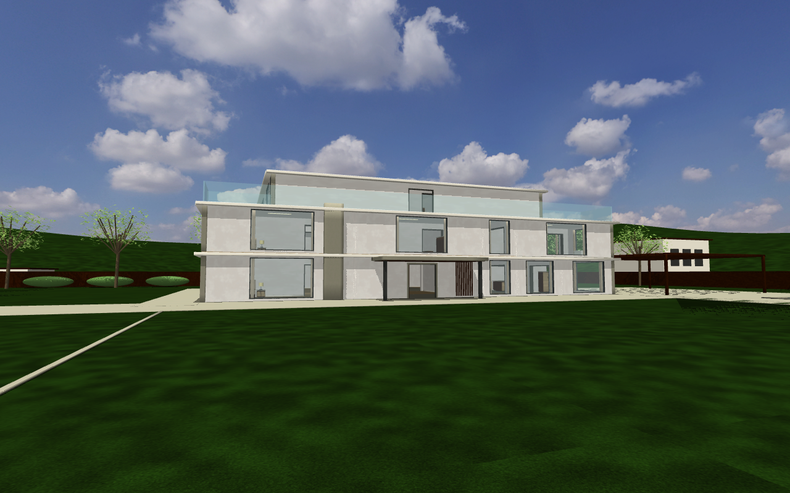

# nerv-world

[](LICENSE) [](https://mujoco.org) [](https://www.python.org) [](CHANGELOG.md)

[](README.md) [](README_zh.md)

面向 MuJoCo 的住宅场景库，包含山坡豪宅、都市公寓，以及宇树 G1、Go2 的场景版本。

房间、门窗、楼梯、家具和庭院由每张地图的布局定义生成。house2 提供草坪、泳池和封闭宅地；
apt2 提供面向中央公园的高层复式。house1、apt1 保留为标准场景。


[house2 图集](#house2--加州山坡豪宅) · [apt2 图集](#apt2--都市复式豪宅) · [运行方法](#快速开始) · [住宅场景说明](docs/residences/README.md)

本仓原名 alice-house，现为 [NERV](https://github.com/Yanshi-Robotics/nerv) 的 `worlds/` 子模块。
`house2/world.yaml` 与 `apt2/world.yaml` 提供 NERV 世界入口。运动策略由独立的
[nerv-policies](https://github.com/Yanshi-Robotics/nerv-policies) 仓库提供。

> 🤖 **如果你是 AI agent，请先读 [AGENTS.md](AGENTS.md)**，了解仓库入口、命令及协作约定。

---

## 目录

- [里面有什么](#里面有什么) · [现有机器人](#现有机器人) · [户型与实拍](#户型)
- [house2 — 加州山坡豪宅](#house2--加州山坡豪宅)
- [apt1 — 232 米高空，正对中央公园](#apt1--232-米高空正对中央公园)
- [apt2 — 都市复式豪宅](#apt2--都市复式豪宅)
- [设计原则](#设计原则) · [网格只是外衣](#网格只是外衣)
- [目录结构](#目录结构)
- [快速开始](#快速开始)
- [场景与机器人组合](#一个场景--机器人一份文件)
- [版本](#版本) · [许可](#许可)

---

## 里面有什么

### 现有场景

| key | 户型 | 规模 | 为什么有它 |
|---|---|---|---|
| **house1** | 大平层三室两厅双卫，单层 | 12 个空间 / 364 ㎡ | 参照真实户型图复刻；客餐一体、主卧套间（衣帽间+主卫带独立浴缸）、中西厨分离。全屋无高差 |
| **house2** | 加州山坡豪宅：三层住宅、庭院、泳池与封闭大门 | 29 个室内空间，楼面面积 1672 ㎡，宅地 80 × 70 m | 室内外导航、双跑楼梯与真实下沉泳池；周围山坡社区作为远景 |
| **apt1** | 曼哈顿满层一户，**62 层**——玄关/画廊/大客厅/餐厅/厨房/主卧套间/客卧 | 13 个空间 / 345 ㎡ | 为**窗外**建的。三面落地玻璃、脚下 232 米空气、正前方是中央公园的真实航拍。考的是「视觉信息极强但绝大部分够不着」这种情形 |
| **apt2** | 曼哈顿复式顶层豪宅，**62–63 层**——双高大客厅 + 一部双跑楼梯 | 24 个空间 / 690 ㎡ | 采用浅橡木、石材与亚麻布艺，完善家具和门窗收口。餐椅、单椅和茶几保留凸分解碰撞与腿间空隙；沙发保留 0.35 m 座面及 G1 坐姿。 |

**建造顺序：house1 → house2 → apt1 → apt2。**

名字不成体系是**有意的**。`house1` 与 `house2` 是这个仓最早 build 出来的两个地方，
名字保持原样不改——它们是「一行几何都不手写、全部由代码生成」这套做法第一次跑通的地方，
留个纪念。house1 虽然只有一层，但它就是一栋 house。
第三个地方是曼哈顿 62 层的**公寓**（apartment）而不是房子，所以从它开始按类型命名：`apt1`。
`apt2` 是它楼上那套复式顶层豪宅，2026-08-22 建成
（设计草案见 [`docs/apt2-设计草案.md`](docs/apt2-设计草案.md)）。

⛔ **key 不轻易重命名**：它是仓外消费方（世界服务）用来选场景的标识符，改一次就是一次跨仓破坏。
apt1 在 v0.10 之前叫 `house3`，那次改名是为了让「这是套公寓」写在名字里，
也是本仓**唯一**一次场景改名。
⚠️ 它的贴图目录仍叫 `textures/house3/`、材质名仍带 `h3_` 前缀——那是这个场景的
**资产命名空间**（也是它最早的名字），有意保留，别顺手改。

### 现有机器人

| 编号 | 本体 | 眼高 | 说明 |
|---|---|---|---|
| **go2** | 宇树 Go2 四足机器狗 | ~0.38 m | 头部前视相机；平地速度策略 |
| **g1** | 宇树 G1 人形（29 自由度） | ~1.25 m | 站立 1.38 m；头部相机装在躯干上、下俯 10° |

同一间屋子在这两双眼睛里差别很大——这正是场景**按真实做、不为某一种机器人定制**的理由。

### 空间构成

主卫（独立浴缸）· 衣帽间 · 小孩房（含卫浴）· 主卧 · 过道 · 客卫 · 次卧 ·
餐厅（含西厨中岛）· 中厨（含晾晒）· 客厅 · 玄关 · 洗衣房

### 户型

关掉天花板俯视，可以看清整套动线：西侧是主卧套间与小孩房（静区），一条过道横贯东西，
东侧是客厅、玄关与服务区（动区）。


### 公共区

客厅与餐厅之间的墙整段拆除，电视立在原墙位置当软隔断——大平层的客餐一体做法。

| 客餐打通 | 客厅 |
|---|---|
|  |  |

### 居室与服务区

| 主卧 | 主卫（独立浴缸） |
|---|---|
|  |  |

| 小孩房 | 中厨 |
|---|---|
|  |  |

中厨这张值得多看一眼：橱柜沿西墙一字排开（洗碗机·水槽·灶台·烤箱），储物高柜与冰箱贴北墙，
中间整条是通行区。**这是 2026-07-25 重排过的**——之前鞋帽间的整墙柜横在房间正中还堵着门，
把 45 ㎡ 切成三块，机器狗钻进 54 cm 的缝里就出不来。

### house2 — 加州山坡豪宅


80 × 70 米宅地围绕三层主楼展开，南侧是 30 × 25 米草坪，东南侧是 15 × 6 米泳池。
暖白墙面、浅色石材与木饰面连接室内外空间；退台和玻璃栏板形成面向庭院的露台。

| 草坪与主楼 | 一层客厅 |
|---|---|
|  |  |

| 二层主卧 | 三层工作室 |
|---|---|
|  |  |

入户门固定敞开，步道和车道通向关闭的外大门。泳池有独立池壁、池底及台阶，水面不承重。
树木、挡土墙和不同标高的邻宅构成山坡社区远景，外围街景不开放通行。
[完整场景说明](docs/residences/README.md)包含布局、资产来源和复现方法。

<details>
<summary>楼梯结构与通行细节</summary>

一部双跑楼梯是**五段，其中两段是平台**——楼层平台 → 上行跑 → 中间休息平台 →
回头跑 → 上一层的楼层平台。两块平台缺一不可：少了中间平台，两跑接不上；
少了楼层平台，人爬上来脚下是空的。每一段的**最后一块踏板和下一段的起始平台
首尾相接、正好差一个踢面**，所以楼梯必然是连着的——这是算出来的，不是对齐出来的。

| 楼层平台上正对上行跑 | 踩在上行跑中间，右手是梯井隔墙 |
|---|---|
|  |  |

| ⭐ 中间平台：回头跑就贴着平台边起步 | 同一块平台的另一侧，回望上行跑 |
|---|---|
|  |  |

| 入口柱廊与门厅 | 顶层梯口：上面没梯段了，用栏板封住 |
|---|---|
|  |  |

爬到上一层，落脚的是**楼层平台**——那是这一层唯一铺了楼板的地方，其余留空给梯段升上来：


尺寸按《住宅设计规范》GB 50096-2011 §6.3 取：踢面 0.16 m、踏面 0.30 m、梯段净宽 1.20 m、
平台进深 1.40 m、梯段净高 2.63 m。层高 2.88 m 是**由楼梯反推**出来的（2 × 9 × 0.16）。
两跑之间是一道 0.12 m 的实心隔墙而不是空槽——空槽正好卡机器人的脚。
上面两层的梯井只铺**楼层平台**那一条带，梯段升上来的地方留空。

推导过程、依据的规范条文、以及两次做错的经过，都记在
[`scenes/house2/楼梯设计.md`](scenes/house2/楼梯设计.md)。**改楼梯之前先读它。**

</details>

### apt1 — 232 米高空，正对中央公园


house1 考平层导航，house2 考爬楼，**apt1 考的是窗户**。三面落地玻璃，楼板离街面 232.5 米，
而透过玻璃看到的一切都**够不着**——走多远都改变不了。

| 大客厅整面观景墙 | 从入户门望出去的 15 米轴线 |
|---|---|
|  |  |

**这片景色没有一层是画上去的贴图。** 它分四层搭出来，每层从哪儿开始是**算视差算出来的**——
横移 8 米，120 米处的楼在画面上移动 61 像素，600 米处移动 12 像素，3 公里外只移动 2.4 像素。
600 米以内必须是真几何：

| 层 | 是什么 | 来源 |
|---|---|---|
| 无限远 | 真实实拍天空，做成六面立方图 | [Poly Haven](https://polyhaven.com) HDRI（CC0） |
| 120–600 m | 12 栋点名塔楼，用它们的真实高度（中央公园大厦 472.4 m、111 W57 435.3 m…） | NYC Open Data |
| 0.6–4 km | **2716 栋真实曼哈顿建筑**，只做体量 | NYC Open Data 建筑轮廓 |
| 地面 | 中央公园的真实航拍照片，按街网转正 29.05° | USGS NAIP（公共领域） |

⚠️ 拉建筑数据时，过滤条件必须**含 `'Merged'`**——111 West 57th Street 继承的是 1924 年
Steinway Hall 的记录，不含它就会被静默丢掉，而它是定义当前亿万富翁街剪影的三根针之一。

#### 怎么证明它不是一张背景板

同一个朝向，相机东移 6 米。盯着近处的窗框相对身后的公园移动：**近景和远景移动的量不一样**，
这是画上去的背景板做不到的。中景之所以非得用真几何而不是照片，原因就在这里。

| 相机在中线偏西 3 米 | 同朝向，东移 6 米 |
|---|---|
|  |  |

#### 这栋楼本身，以及它挨着谁

本楼也是建出来的——你站在一个真实体量里面，不是一个飘着的盒子。它离公园南沿 **34 米**
（中央公园南路的路宽）。这个数字是自检逼出来的：第一版放在 120 米开外（大约 57 街），
**公寓和公园之间整整隔着一排真实的楼**。

| 本楼外景 | 越过窗框往正下方看 | 中央公园全宽 |
|---|---|---|
|  |  |  |

#### 屋里

平面是一条贯通轴线：入户门 → 画廊 → 大客厅在同一条轴上，形成 15 米通视，尽头就是公园。
画廊是一面 12 米长的挂画墙；大客厅向餐厅与厨房敞开。


| 画廊 12 米展线 | 餐厅 | 厨房中岛 |
|---|---|---|
|  |  |  |

| 主卧转角窗 | 客卧望中城 | 出生点，机器狗眼高 |
|---|---|---|
|  |  |  |

最后那张才是整个场景的意义所在：0.38 米高度上，机器狗看到的主要是地板、踢脚线和家具底面，
外加一条它永远够不着的天空。同一个房间，换成人形 1.25 米的相机就是另一个房间。

屋里的家具，apt1 是第一个穿上**真实网格外衣**而不是全靠基本体拼的场景。
怎么在**不改变任何一次碰撞**的前提下把网格挂上去，见[网格只是外衣](#网格只是外衣)。

#### 逐间看

一层十三个空间，排成三条带。北带朝公园，南带朝中城，中脊一扇窗都没有——
对一台靠相机导航的机器人来说，这恰恰是最有意思的地方。

| 带 | 房间 |
|---|---|
| **北带 · 景观** | 主卧 · 餐厅 · 大客厅 · 厨房——四间全部贴着观景墙 |
| **中脊 · 无窗** | 衣帽间 · 画廊（12.6 m 展线）· 东过厅——整天靠灯 |
| **南带 · 城市** | 主卫 · 客卧 · 客卫 · 入户玄关 · 洗衣房 · 书房 |

| 书房——书桌对着东南转角窗 | 主卫——独立浴缸，onyx 墙 |
|---|---|
|  |  |

洗衣房是特意留给**机器人的房间**：一道 0.95 m 的门直通画廊主流线，洗烘设备全挤在南端，
北半留空当停机位（`ROBOT_HOME_XY`）——机器人待在那儿，不站在任何人的动线上。
（衣帽间和几间服务用房拍出来就是几个纯色盒子，不上镜——所以它们只有文字，没有相机。）

#### apt1 的一天

同一层楼，在四个时刻是四个不同的地方。磁盘上的产物逐字节不变——**白天就是产物本身**；
早晨、黄昏、夜晚是**运行期预设**（`scenes/apply_time_preset.py`），在已加载的模型上改写
灯光字段、材质自发光、天空盒与立面贴图：


| 早晨 6:40 | 白天 |
|---|---|
|  |  |

| 黄昏 19:35 | 夜晚 23:10 |
|---|---|
|  |  |

- **早晨**——冷色北向天光，外加一道暖光从东窗横切过厨房中岛。
- **白天**——产物本身，一个字段不改。
- **黄昏**——朝北的公寓永远看不到日落本身；它看到的是**上西区隔着公园被染成金色**、
  东侧冷成玫瑰紫，西窗在主卧地板上拖出一条长长的琥珀色光带。这种不对称本身就是方向感。
- **夜晚**——几千扇各自点亮的窗（夜间立面贴图，不是调自发光糊弄）、室内暖色灯岛，
  以及压成**黑洞**的中央公园——纽约夜景最强的单一识别符。

预设里烤着两个用实测换来的事实。其一：MuJoCo 渲染器只点亮 **headlight + 7 盏模型灯**
（`mjMAXLIGHT=100` 是场景*容量*，不是渲染能力）——所以每个时段都是同一批七个灯位的
重新指向，场景敢多声明一盏，`check_lights_render` 验收门当场变红。
其二：机器人自己的 XML 里带着一盏无名方向光，实测占了约 68% 的像素——夜晚的第一件事
就是把它关掉。

这几张静帧同时就是验收门——整帧亮度必须沿 白天 → 早晨 → 黄昏 → 夜晚 单调下降，
且没有任何一间屋子允许黑掉：

```bash
python tools/make_time_stills.py --scene apt1
```

### apt2 — 都市复式豪宅


62—63 层的复式住宅保留双高客厅、上层环廊及中央公园朝向。浅橡木、石材和亚麻布艺
搭配胡桃木与深色金属，家具圆角、床品、柜门分缝和门窗收口补齐近距离观察的细节。

| 转角主卧 | 餐厅 | G1 坐姿 |
|---|---|---|
|  |  |  |

餐椅、单椅和茶几保留家具腿之间的真实碰撞空隙，沙发保留 0.35 米座面和 G1 坐姿。
新增材质独立定义，窗外城市的坐标、标高与中央公园关系沿用既有场景。
[住宅场景说明](docs/residences/README.md)提供更多配图与运行方法。

<details>
<summary>家具碰撞、坐姿与复式结构</summary>


apt2 的餐椅、单椅和茶几采用凸分解碰撞，保留家具腿之间的真实空隙；沙发座面高度适配 G1。
这些家具固定在世界中，具有坐姿支撑和碰撞空隙，并不代表可以抓取或推动。

上图在加载 G1 的既有坐姿后，经过 **3 秒物理仿真**拍摄。当前场景中，骨盆抬升 4.6 cm、
水平滑移 3.0 cm，躯干倾斜 11.5°。[住宅升级](docs/residences/README.md) 保留该能力，
并增加独立材质及建筑细节。

#### 为什么以前坐不下：问题出在「部件是按材质拆的」

直觉上，家具已经有真网格了，把碰撞打开不就行了？**不行。**
`decor/convert.py` 是按**材质**拆部件的（glTF 的 primitive 本来就按材质分组），
而 MuJoCo 对每张碰撞网格只取它的**凸包**。两件事一叠加，凸包把空腔整个吞掉：

| 资产 | 凸度（实体积 ÷ 凸包体积） |
|---|---|
| 餐椅 | 0.30 |
| 单椅骨架 | 0.12 |
| 圆茶几 | 0.22 |
| 大床软包 | 0.07 |

⇒ 直接开碰撞，只是把「一个实心盒」换成「一个实心凸包」，椅腿之间照样是实的。

解法是 **CoACD 凸分解**（`decor/hulls.py`，离线跑一次，凸块不入库）。
下面两组数**都是从仓里两份产物直接量出来的**——从上往下打一片射线读命中高度
（单位 cm，`·` = 一直打到地面）：

```
 apt1 · 单椅（一个隐身碰撞盒）        apt2 · 餐椅（17 块 CoACD 凸块）
  110  110  110  110  110  110  110    ·   94   95   95   95   94    ·   ← 靠背
  110  110  110  110  110  110  110    ·   78   87   87   86   79    ·
  110  110  110  110  110  110  110    ·   36   45   46   46   36    ·   ← 座面
  110  110  110  110  110  110  110    ·   43   45   45   45   43    ·
  110  110  110  110  110  110  110    ·   43   43   43   43   43    ·

  占地上方一律 110 cm —— 那是一块        靠背 94–95、座面 43–46，边上直接
  0.90×1.06×1.10 的实心砖                看到地面 —— 是一把真椅子
```

再横着打一条，同一条高度、两个场景对照：

| 高度 | apt1 的单椅（一个盒子） | apt2 的餐椅（凸块） |
|---|---|---|
| 座面高度 0.45 m | 撞在盒子上 | 撞在 `furn_dn_w1__h8` 上，0.737 m —— **椅子确实在那儿** |
| 座面**下方** 0.26 m | 撞在 `furn_gr_ch1` 上，**0.721 m** —— 被实心盒挡住 | **一路穿过椅子**，15.25 m 外才撞到图书室的书架 |

⇒ 同一条射线，一个被挡住、一个从椅腿之间穿了过去。这就是「真碰撞」的全部意思。

| 六把真碰撞餐椅 | 大客厅：单椅与茶几也是 |
|---|---|
|  |  |

以下为精修前版本的碰撞成本对比；当前场景的双相机实测见[住宅验证记录](docs/residences/validation.md)：

| | ngeom | 其中碰撞凸块 | 实时倍率 |
|---|---|---|---|
| apt1（家具全是隐身盒） | 3329 | 0 | 15.7× |
| **apt2（12 件上了真碰撞）** | 3719 | **184** | **14.1×** |

整套房子加上真碰撞只慢了约 10%。⭐ 关键在于 `nmeshgraph` 与**件数无关**——
网格是按资产共享的，所以 6 把同款餐椅只声明一套凸块，重复摆放几乎免费。

⚠️ 但别再说「网格是免费的」：`contype=0 且 conaffinity=0` 时 MuJoCo **完全跳过 qhull**，
这才是纯视觉外衣便宜的唯一原因。开了碰撞，qhull 就要跑。

#### ⛔ 一个不写就静默出错的地方

MuJoCo 的**默认接触太软**：3.9 kg 的板从 1.20 m 砸到 49 mm 厚的座面凸块上，
会**直接穿过去**掉到地上。阈值很陡——每步位移 3.2 mm 还好、4.1 mm 就穿。
⚠️ 减小时间步没用、加 `margin` 也没用（都实测过）。有效的只有一条：`solref="0.005 1"`。

不写它的后果是「慢慢坐下去一切正常、摔一跤砸上去就穿模」，而且**编译不报错、慢速测试全绿**。
所以它由一道单独的验收门钉着。

#### 沙发**不用** CoACD —— 判据是「这件家具的尺寸由谁说了算」

餐椅长什么样是艺术家定的，要的是形状保真；而沙发的座面高度是**机器人定的**。
从 G1 身上量：小腿 0.318 m + 踝离地 0.033 m ⇒ 膝 90°、脚掌踏平时座面 ≈ **0.351 m**。
把 G1 摆成坐姿、用策略契约的增益保持住、推 3 秒物理：

| 座面高 | 结果 |
|---|---|
| 0.30 m | ✅ 坐住 |
| **0.35 m** | ✅ 坐住 |
| 0.40 m | ❌ 滑落（躯干倾 33.6°） |
| 0.45 m | ❌ 直接倒（80.5°） |

⇒ **上限是 0.36 m。** 而拉一张真沙发网格来，它的座面是艺术家做的那个高度，
`_fit_scale` 又只做**均匀缩放**——把座面压到 0.35 会把整张沙发一起缩小，比例就毁了。
所以沙发用手写基本体（`furniture.sofa()`），座面 0.35 / 进深 0.45 一次定死。

⭐ 顺带一个意外结论：**市面上的真家具对 1.32 m 高的 G1 全都太高**——
Poly Haven 餐椅座面 42.3–46.1 cm、单椅 53.0–70.9 cm，两者都在失败带里。
它们照旧有真碰撞（撞得到、脚伸得进椅子腿之间），只是不进「能坐」名单。

#### 双高客厅与那部楼梯

| 挑空：相机悬在空中往下看 | 双跑楼梯 | 63 层环廊 |
|---|---|---|
|  |  |  |

竖向尺寸的推导方向和 house2 **正好相反**，而且必须这样：
层高被 apt1 的 `FLOOR_TO_FLOOR = 3.75` 钉死（`ELEV = 62 × 3.75`，改了窗外整片城市就错位），
所以是**固定层高、反推踢面高**，自由变量只剩「一层几个踢面」这个整数。

| 踢面数/层 | 踢面高 | 一跑 | 跑长 | 坡度 | |
|---|---|---|---|---|---|
| 20 | 0.18750 | 10 | 2.70 | 32.01° | ❌ 超规范上限 0.175 |
| 22 | 0.17045 | 11 | 3.00 | 29.60° | ✅ 但贴着上限 |
| **24** | **0.15625** | **12** | **3.30** | **27.51°** | ✅ 取它 |

窗外那片城市**直接引用 apt1 的**（`SKYBOX` / `SKYLINE` / `GROUND_SLABS`），
外轮廓也与 apt1 逐位相同（23.0 × 15.0 m），所以立面尺寸与望公园的自检常量全部复用。

| 整体俯视（挑空处一直看到 62 层） | 贯通轴线 | 主卧转角窗 |
|---|---|---|
|  |  |  |

#### 「坐姿」这张图是怎么出的

⛔ 它不能像别的图那样静态渲染——**产物里的机器人站在世界原点**（摆位是运行期的事）。
所以坐姿按**关节名**声明在 layout 的 `SIT_POSES` 里（⛔ 不按下标，换机器人时下标会静默错位），
由 `scenes/apply_pose.py` 装配并**推物理到稳态**再拍：

```bash
ALICE_SCENE=apt2 python tools/make_docs_images.py S1
#   沉降后：骨盆 +0.046 m / 滑移 0.031 m / 倾角 11.4° / 接触 11
```

出图时把判据一起打出来，是因为「图看着对」和「机器人真坐住了」是两回事。

⚠️ **还没做的**：家具的**铰接**（冰箱门、抽屉还打不开）和**会操作的策略**
（现役 G1 是平地行走策略，不含坐下/抓取——它是被摆成坐姿的，不是自己走过去坐下的）。
详见 [`待办事项-可交互家具.md`](待办事项-可交互家具.md)。

</details>

### 机器人视角

场景最终要服务的是机器人的眼睛。下面几张都是**四足机器狗头部相机**看到的画面（高度 0.38 m），
最后一张是同一间厨房换成**人形眼高**（1.25 m，G1 头部相机的实际高度）的对照——同一个场景，不同机器人看到的
东西差别很大，所以场景按真实做、不为某一种机器人定制。

| 出生在玄关 | 客厅（正对电视墙） | 过道 |
|---|---|---|
|  |  |  |

| 站在门口望进中厨 | 窗外的城市 | 人形视线高度看同一间中厨 |
|---|---|---|
|  |  |  |

> 「站在门口望进中厨」这张就是实测里 ANIMA 宣布「已到厨房」时看到的画面——
> 吊柜、深色台面、不锈钢洗碗机门、右侧落地冰箱都在画面里。

### 图是怎么出的

**别手工截图。** 机位全写在 `make_docs_images.py` 里，改了场景就重跑：

```bash
ALICE_SCENE=apt1 python tools/make_docs_images.py        # 该场景全出
ALICE_SCENE=apt1 python tools/make_docs_images.py V9 V11 # 只出指定几张
python tools/make_time_stills.py --scene apt1            # 四时段静帧（同时是验收门）
```

场景由 `ALICE_SCENE` 环境变量指定（不给就是默认场景——多半不是你刚改的那个）。

背景：第一版配图是一张张手摆机位截的，中厨一重排就全过时，还没人记得当初相机在哪。

---

## 设计原则

**几何不手写，全部由布局定义生成。** 改屋子只改 `layout.py`，重跑生成器即可——
场景与消费方（世界服务判断「机器人在哪间屋」）读同一份真相源，不会两处坐标打架。

**⛔ 按真实做，不为某一种机器人定制。** 场景是「现实」，不是给某台机器的考题。
四足机器狗的相机只有 ~0.5 m 高，人形是 1.5 m 以上——**为了迁就狗去压低家具，
换成人形就全得重做**。看不见高处是**机器人侧**的局限，该用环视、抬头、换机位去解决，
不是把抽油烟机装到膝盖上。

> 这条是纠正来的。早期版本这里写的是「识别特征必须铺在 0.3–0.9 m 高度带」——那是
> 拿一台特定机器人的视角当设计目标，方向错了（Jeff 2026-07-25 校正）。

**摆位要真实：沿墙布置，中间留通行区。** 真实住宅的橱柜、衣柜是贴着墙走的，屋子中间是人
走路的地方。**别让大件家具横在房间中央**——2026-07-25 实测踩过：12 空间合并时鞋帽间的
整墙柜留在了中厨正中（还堵着门），把 45 ㎡ 的房间切成三块、只靠 54 cm 和 90 cm 两条缝
连通，机器狗进去就卡死。真实厨房重排之后，问题自然消失。

顺带说明：真实厨房里烤箱、洗碗机**本来就嵌在台面下**（0.1–0.9 m），冰箱本来就落地——
它们恰好落在低视角能看到的位置，这是真实的结果，不是为谁让步。

**家具是组合件，不是基本体。** 一把椅子 = 座面 + 靠背 + 两根竖档 + 四条腿 + 前后横撑；
一盏落地灯 = 配重底盘 + 细杆 + 收口 + 灯罩 + 收头。见 `furniture.py`。

**封顶。** 有天花板，机器人抬头看到的是屋顶不是天空；天花板单独归一个 geom group，
出俯视图时整层关掉即可。

**窗外有世界。** 近处树木草地 → 中景楼房 → 远处城市天际线背景板。apt1 里这块背景板
被换成了一路到底的真实数据。

### 网格只是外衣

house1 的家具由基本体组成。apt1 保留这些基本体——然后再把**下载来的网格
当外衣套上去**。底下的盒子仍然是碰撞真相，网格是纯视觉的（`contype="0" conaffinity="0"`）。

让这件事安全的规矩是一条**包含性不变式**：每张网格都缩到完全装进它所装饰的盒子里，
于是任何打得到网格的射线**一定先打到盒子**，**所有射线读数和没穿外衣时逐位相同**。
这一条非要不可，因为 **`mj_ray` 根本不看 `contype`**——「它只是视觉的」这句话对物理成立、
对射线不成立，而消费方的雷达和导航探测走的全是 `mj_ray`。

而且这条不变式是**自检强制**的，不是靠自觉：`check_decor_ray_invariance` 从每件穿了外衣的
家具外面打射线，要求带外衣和不带外衣的读数完全一致。

两个用血换来的坑，两个都**编译干净、渲染正常**：

- ⛔ **把碰撞盒的 `rgba` alpha 设成 0 来隐身，会把它从 `mj_ray` 里删掉。**
  盒子照样碰撞，所以物理看着没事，而导航和雷达悄悄地能直接穿过家具。
  正解是把它丢进一个不画的 `group`——`group` 只管画不画，射线不受影响。
  ⛔ 但组号不能随便挑：**2 和 3 归机器人**（MuJoCo Menagerie 惯例），房子占了它们，
  消费方就没法把「机器人自己」和「房子」分开、会当场拒绝启动。房子这边用 **4**
  （`make_house.HIDDEN_BOX_GROUP`），且必须 ≤ 5（分组掩码只有 6 个槽）。
- ⛔ **网格探出盒子时，把盒子改大完全没用**，因为包含性缩放会把网格按比例一起撑大，
  超出量原封不动。真正的原因在 MuJoCo 编译 `<mesh>` 的方式上，而且有**两层**：
  它把顶点搬进惯性系（既平移到重心、**也旋转到惯性主轴系**），所以从 `mesh_vert`
  读出来的顶点既不是文件坐标、也不只是平移过的文件坐标；同时它又把这个重定位量
  **自己补偿掉了**（抄进 `geom_pos`/`geom_quat`），所以摆位时**不该**再补一次。
  漏掉那次旋转，算出的包围盒就是"轴被置换过"的（床记成 0.66×2.21×2.15，真值
  1.69×2.06×0.78）；多补一次平移，多部件资产的部件就各自往外飞自己的重心那么远。
  `decor/calibrate.py` 用一个编译出来的探针模型把真实包围盒实测出来写回 lock，
  而 `check_scene.py` 的两条自检（lock 自洽对账 + 直接量网格顶点）守着这两件事。

资产字节**不入库**。`decor/manifest.py` 登记要拉什么，`decor/fetch.py` 负责下载并守着一道
**可执行的许可闸**——上游许可不在白名单里的字节直接拒绝写入，而不是只打个警告——
`decor.lock.json` 逐个部件记 SHA-256。裸 clone 照样能生成全部场景，只是家具不穿外衣而已。

---

## 目录结构

```
scenes/
  manifest.py       ⭐ 有哪些地方（与 robots/manifest.py 成对，正交交叉组合）
  house1/layout.py  ⭐ 那个地方的布局单一真相源（房间矩形/门窗/家具/窗外景物）
  house1/shots.py   那个地方的配图机位
  house2/layout.py  三层小楼：多出楼层、楼梯、平台、梯井隔墙、栏板
  house2/shots.py
  house2/楼梯设计.md ⭐ 楼梯尺寸怎么推出来的、依据哪条规范、做错过什么
  apt1/layout.py  62 层曼哈顿大平层：玻璃幕墙、窗景四层、真家具
  apt1/shots.py
  apt1/nyc_massing.py  ⭐ 2716 栋真实曼哈顿建筑（由 make_view.py --nyc 生成，入库）
  furniture.py      参数化家具构件库（椅子/桌子/灯具/花瓶/绿植…），所有场景共用
decor/              ⭐ 真家具网格——脚本入库，资产字节永不入库
  manifest.py       拉什么 + 可执行的许可白名单
  fetch.py          下载 → 转换 → 减面 → 写 decor.lock.json 与 ATTRIBUTION.md
  convert.py        glTF/GLB → 按材质拆成单网格 OBJ + PNG（要 trimesh，⛔ 生成器永不 import 它）
  calibrate.py      ⛔ 用编译出来的探针模型实测每张网格的真实重心与包围盒
  robocasa.py       RoboCasa 厨房电器 → decor 零件（剥掉 joint/actuator/option）
  assets/           gitignore——拓下来的字节住这儿
robots/
  manifest.py       ⭐ 机器人清单单一真相源（模型/出生高度/相机/策略/力矩怎么发）
  go2/              宇树 Go2 模型（含头部前视相机）
  g1/               宇树 G1 人形，29 自由度（由 import_from_menagerie.py 从 Menagerie 导入）
tools/              入口脚本，都从仓根跑：`python tools/<名字>.py`
  make_house.py       布局 + 机器人 → build/<场景>-<机器人>.xml（MJCF）
  check_scene.py      ⭐ 场景自检：查产物不查声明，生成之后必跑
  walkthrough.py      第一人称漫游，用来人眼验收（WASD + 鼠标，带碰撞与重力）
  make_docs_images.py 出 README 配图（机位写在 shots.py，一条命令重出）
  make_textures.py    程序化生成贴图（木地板/瓷砖/大理石/地毯/织物/城市天际线/挂画）
  make_view.py        apt1 的窗景：--sky --sky-phase（HDRI→六面，分时段）· --nyc（建筑轮廓）· --naip（航拍）· --calib
  make_time_stills.py 四时段静帧：出 T-*.png 与 T0 拼图，并给预设把门（亮度必须单调下降）
  fetch_assets.py     下载 CC0 室内材质（ambientCG），带 SHA-256 记账与 --verify
build/              ⭐ **产物**（入库的交付物，不是构建缓存）：<场景>-<机器人>.xml
                    ⛔ 里面那些相对路径按"住在仓根下恰好一层"算死了，别把它挪走
textures/ · docs/images/<场景>/   生成的贴图 · README 配图
                    ⚠️ apt1 的贴图住 textures/house3/、材质名带 h3_ 前缀 —— 那是这个场景的
                    资产命名空间，沿用它最早的名字，有意不跟着 key 改（见上面「建造顺序」）
```

## 快速开始

```bash
git clone https://github.com/Yanshi-Robotics/alice-house.git
cd alice-house
pip install mujoco numpy pillow

# 看一眼（场景已经生成好了，直接就能开）
python -m mujoco.viewer --mjcf=build/house1-go2.xml    # 单层大平层，四足那份
python -m mujoco.viewer --mjcf=build/house2-g1.xml     # 三层小楼带楼梯，人形那份
python -m mujoco.viewer --mjcf=build/apt1-g1.xml    # 62 层俯瞰中央公园，人形那份

python tools/walkthrough.py --scene apt1            # 自己走进去看（第一人称）
```

改了屋子要重新生成：

```bash
python tools/make_textures.py                        # 贴图（只在改过贴图时要跑）
python tools/make_house.py                           # 全场景 × 全机器人
python tools/make_house.py --scene house2 --robot g1 # 只出三层楼的人形那份
python tools/check_scene.py                          # ⭐ 生成之后必跑
ALICE_SCENE=house2 python tools/make_docs_images.py  # 重出配图
```

下面这些是可选的。apt1 的贴图和那 2716 栋楼**已经入库**，clone 下来直接就能编译；
只有想改它们时才需要重跑。**家具网格是例外**——字节永不入库，所以裸 clone 上
apt1 的家具会一直是素盒子，直到你把它们拉下来：

```bash
pip install trimesh fast-simplification           # 只有下载/转换那一侧要它

python tools/fetch_assets.py                            # CC0 室内材质（ambientCG）
python tools/make_view.py --all                         # 天空六面 · 中央公园航拍 · 2716 栋楼
python -m decor.fetch                             # 家具网格（Poly Haven CC0 + Objaverse CC-BY）
python -m decor.robocasa                          # 厨房电器（RoboCasa，CC-BY）
python -m decor.calibrate                         # ⛔ 上面两条只要跑过，这条必跑
python tools/make_house.py && python tools/check_scene.py     # 重新生成并自检
```

⛔ `decor/calibrate.py` 不是可选的。它用编译出来的探针模型实测每张网格的真实重心与包围盒；
不跑它，网格会摆偏、探出碰撞盒，射线不变性自检会直接判红。

`check_scene.py` 不是走过场。它把每份产物真的用 MuJoCo 编译一遍，然后**沿整条上楼路线
逐点打射线**——楼层平台 → 上行跑 → 中间平台 → 回头跑 → 上一层 → 门口，
要求处处有实地、相邻高差不超过一个踢面、终点正好高一个层高。另一项单独核**四个接头**
（每一段的末级踏板和下一段的起始平台，首尾相接 + 差一个踢面）。

它查的是**产物**不是布局里的**声明**，而且这两项检查是有来历的：早先那版只沿**单独一跑**
打射线，于是"回头跑没接到平台上"这种结构性错误它**报了绿**——绕着走确实摸得到一条路。
**查"存在一条路径"证明不了"这是一部楼梯"。**

**策略不住这里（2026-09-02 起）。** 训练好的运动策略是训练产物，不是场景资产；消费方把它们放在
自己的策略发布架上：`policy.onnx` + `contract.json` + `release.yaml`（力矩模式、命令范围、命令死区、
转弯特性）。本仓只交付「地方」和「机器人本体」。跑通的部署器见 anima-zero 的继任者
[NERV](https://github.com/Yanshi-Robotics/nerv)。

## 一个「场景 × 机器人」一份文件

`house1-go2.xml`、`house2-g1.xml`……每个组合各一份。为什么不合成一份：
机器人的网格路径在 MJCF 编译期就定死了，两台塞不进同一个模型，两个场景同理。

**「有哪些地方」和「有哪些身体」是两份独立清单**（`scenes/manifest.py` 与 `robots/manifest.py`），
生成时交叉组合。同一台 G1 两栋楼都能进，同一栋楼两台机器人都能住。
产物文件名的规则住在 `scenes/manifest.py`，消费方调它而不是自己再拼一份——改名不会两边脱节。

**机器人清单 `robots/manifest.py` 是「这台机器人是什么」的单一真相源**——模型在哪、
出生多高、相机叫什么、脚是哪几个 body。加一台新的就往里追加一条，再跑一次生成器。

⚠️ 清单里**不重复**任何属于策略的东西（关节顺序、增益、观测格式、控制周期、力矩模式、
命令范围）——那些跟着策略住在消费方的发布架上，抄两份必然对不上。

## 改屋子 / 加新地方

改 `scenes/<名字>/layout.py` 里的房间矩形、门窗、家具，重跑生成器，**再跑 `check_scene.py`**。
构件库（家具/贴图）直接复用。

加**新地方**＝往 `scenes/manifest.py` 追加一条 + 写 `scenes/<key>/layout.py`，生成器不用动。
多层场景在平面模型之上多几样：每间屋一个 `floor` 键、一个 `FLOOR_Z(n)`，
以及 `STAIRS`（梯段）/ `LANDINGS`（中间平台）/ `WELL_WALLS`（梯井隔墙）/ `GUARDS`（栏板）；
外加两个把竖井打通的键——下面几层 `no_ceiling`，上面几层 `floor_rects`（只铺楼层平台，
梯段升上来的地方留空）。楼梯怎么走由 `stair_route(floor)` 给出**唯一**一份权威描述，
自检和漫游都照它走——两处各写一份正是出过事的地方。

⚠️ **楼梯尺寸是算出来的，不是选出来的。** 先定台阶 → 推层高 → 推楼梯井 → 推房子边界，
绝不反过来——层高和楼梯各自定死，顶步就会悬在半空，前作正是这样，直到滚球验证才发现。
另外两条同样是踩出来的：**一跑的踏板数 = 踢面数 − 1**（最上面那一级就是平台本身）；
踏面取 0.30 m 是因为 G1 脚长约 0.25 m，0.26 m 只剩一厘米余量，盲走策略必然踩空。

---

## 版本

见 [CHANGELOG.md](CHANGELOG.md)。当前 **v0.14**。

## 许可

本仓的场景生成器、家具与贴图构件库、机器人清单、运动策略和文档采用 **MIT**（见 [LICENSE](LICENSE)）。

打包在仓里的第三方资产保留各自的许可：宇树 Go2 与 G1 模型来自
[MuJoCo Menagerie](https://github.com/google-deepmind/mujoco_menagerie)，
BSD-3-Clause，见 `robots/go2/GO2_MODEL_LICENSE` 与 `robots/g1/G1_MODEL_LICENSE`；
G1 我们改了什么、为什么改，写在 `robots/g1/G1_MODEL_UPSTREAM.md`。

apt1 的窗景是拿**数据**搭的，不是从谁的数据集里拷字节出来。只有派生出来的坐标表
（`scenes/apt1/nyc_massing.py`）入库，其余一律在你自己机器上拉：

| 是什么 | 来源 | 条款 |
|---|---|---|
| 2716 栋建筑轮廓（只存包围盒） | NYC Open Data `5zhs-2jue` | Local Law 11 of 2012，Admin Code §23-502(d)：无注册、无许可、无使用限制，**且无 share-alike**。署名留在 `textures/house3/ATTRIBUTION.md` |
| 中央公园航拍 | USGS NAIP | **公共领域**（美国联邦作品） |
| 天空六面、室内材质 | Poly Haven · ambientCG | **CC0-1.0**——派生出来的 PNG **入库**（`textures/house3/`），否则 apt1 编译不过 |
| 家具网格 | Poly Haven | **CC0-1.0**——拉取，不入库 |
| 床与床头柜网格 | Objaverse（@elba） | **CC-BY-4.0**，逐件核过——拉取，不入库 |
| 厨房电器 | RoboCasa（经 NVIDIA 的 HuggingFace 镜像） | **CC-BY-4.0**——拉取，不入库 |

⛔ **建筑数据有意不用 OpenStreetMap 当主源。** 覆盖率相当（它本来就大半是从纽约市这份数据导入的），
但把 2716 行、由 OSM 派生的坐标表提交进 MIT 仓，构成 ODbL 意义上的「派生数据库」，
share-alike 会附着到那个文件上。

## 致谢

宇树科技（Unitree Robotics）的 Go2 与 G1 模型 · Google DeepMind 的
[MuJoCo](https://mujoco.org) 与 [Menagerie](https://github.com/google-deepmind/mujoco_menagerie)。
