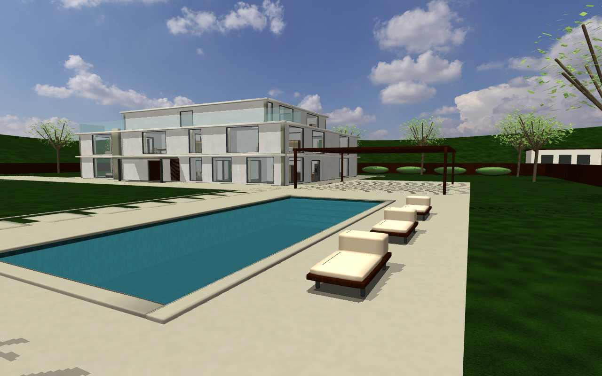

# Residence scenes

`house2` is a three-storey California hillside estate. Its 80 × 70 m property includes a
30 × 25 m lawn, a 15 × 6 m swimming pool, a driveway and a furnished house. The ground
floor connects the entrance, living suite, dining room and garden rooms. Bedrooms and
family spaces occupy the second floor; a studio, gym and viewing terrace occupy the third.
The original two-flight stair dimensions remain 0.16 m rise and 0.30 m tread, with
1.20 m flights, 1.40 m landings and a 2.88 m storey height.


The entrance is fixed open. Robots can cross the property and approach the closed outer
gate. Walls and the gate form a continuous collision boundary. The surrounding roads,
hills and neighboring houses are visual scenery with no accessible interiors.
The pool has separate walls, bottom, steps and water: water is visual only, with no
buoyancy or swimming simulation. The terrace provides a route around the basin.



`apt2` remains a 62nd–63rd floor Manhattan duplex with a double-height living room and
the existing Central Park orientation. Pale oak, limestone, linen, walnut and dark metal
are independently defined for the two upgraded scenes. Rounded furniture, cabinet panels,
bedding, curtain folds and skirting provide detail at robot camera distances.
Dining chairs, armchairs and coffee tables retain their decomposed collision shapes;
the living-room sofa retains its 0.35 m seat and existing G1 sitting pose.


## Reproduction

Run these commands from the scene-library root after installing the dependencies and
fetching the decor assets described in the main README. `make_house.py` generates both
G1 and Go2 variants; edit the layouts instead of editing generated XML.

```bash
python tools/make_residence_textures.py
python tools/make_house.py --scene house2
python tools/make_house.py --scene apt2
python tools/check_scene.py --scene house2
python tools/check_scene.py --scene apt2
python tools/check_residences.py
python tools/walkthrough.py --scene house2 --selftest
python tools/walkthrough.py --scene apt2 --selftest
```

The regression command checks the protected `house1` and `apt1` source/assets and compares
all four regenerated XML files with the saved baseline revision. It also probes property
routes, walls, the gate and pool, including a fault test that makes water collidable.
Hollow bathtub interiors are fixture footprints, not reachable room floor; this annotation
does not add collision geometry or fill the tubs.

Native MuJoCo pictures use the scene's fixed camera definitions:

```bash
python tools/render_residences.py --scene house2
python tools/render_residences.py --scene apt2 --contract ../policies/g1-29dof-turn/contract.json
```

The contract path assumes the NERV submodule layout. A standalone checkout can supply
another released G1 contract. Seated pictures are taken after three seconds of actual
physics settling. Architectural pictures hide the robot; runtime pictures use the normal
NERV camera settings.

## NERV

`house2/world.yaml` registers the world for `humanoid-unitree-g1`, spawning at the
first-floor robot room. `apt2/world.yaml` retains its existing configuration. Both use
640 × 480 images at a configured 12 fps with first-person and third-person cameras.
NERV discovers descriptors when its registry is constructed; an already running registry
must be reloaded by the operator before its world list includes a newly added descriptor.

With NERV's Python environment, the following command runs the released G1 policy,
paced physics and the actual two MJPEG generators. It opens no network ports and does
not interact with existing services. Submit rendering through any GPU scheduling system
required by the host.

```bash
python tools/benchmark_residences.py --seconds 30 --output temp/residence-runtime
```

The runtime report records each stream separately and measures simulation time against
wall time. MuJoCo's native renderer uses its own specular and shininess controls;
these scenes do not depend on a PBR postprocessing engine.

## Source definitions

- [house2 layout](../../scenes/house2/layout.py) and [estate](../../scenes/house2/estate.py): rooms, circulation, property and scenery.
- [apt2 refinement](../../scenes/apt2/refinement.py): independent materials and furniture detail.
- [residential components](../../scenes/residence.py): rounded meshes, metric UVs and shared opt-in components.
- [asset record](assets.json): authored textures and reused asset licenses and hashes.
- [validation results](validation.md): collision checks, reference-scene preservation and actual dual-camera measurements.
