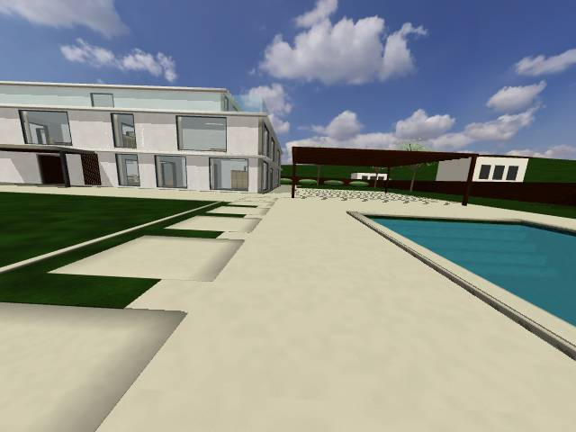
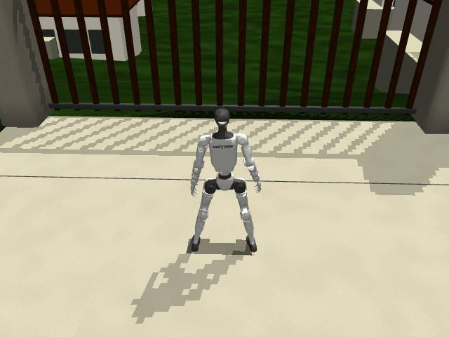
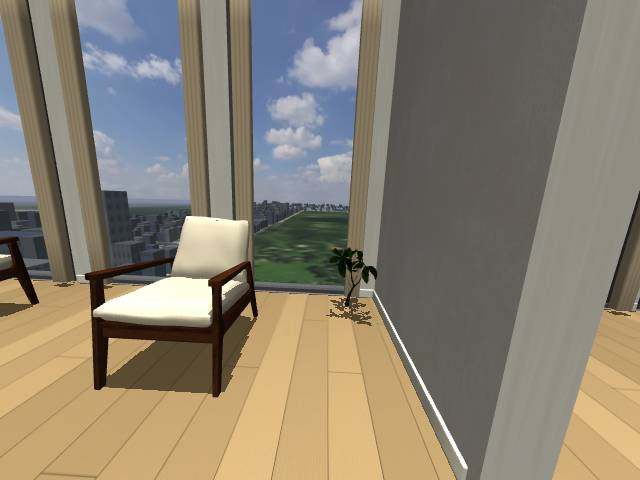

# 住宅升级验证

Historical validation of the numbered scenes before canonical migration. Names and measurements
below describe that revision. See the [current validation](migration/validation.md).

日期：2026-09-07。以下结果来自本机 MuJoCo 和 NERV 实际运行。

## 场景与碰撞

- house2、apt2 的场景检查和漫游自测均通过，覆盖门洞、家具、窗玻璃、楼梯接头、净空和楼层边界。
- house2 宅地通过 586 个路线采样、1,800 个边界采样和 336 个池底采样。外门封闭，池底下沉 1.5 m；水面不承重，故意打开水面碰撞的故障测试能被检测出来。
- 路线检查验证空间可达性与碰撞；未用 G1 策略逐段跑完整条停机房至外大门的往返路线。
- apt2 沙发坐姿经过 3 秒真实物理沉降：骨盆抬升 4.6 cm、水平滑移 3.0 cm、躯干倾斜 11.5°。
- NERV 完整测试：34 项通过，包括通过脚本大脑、路由、世界及机器人接口执行 G1 在 apt2 内行走的集成测试。

## 标准场景

以升级前已保存的版本 `0c1fdcebdeb21134b368b170fbe7a12810e812a2` 为基线，171 个保护文件一致，包含 house1、apt1 的源定义、原始资产和配图。调整后的生成器在内存中重建两张标准地图的 G1、Go2 版本，四份 XML 与基线逐字节一致。house2、apt2 四份 XML 也与当前源定义重新生成的结果一致。

## 双相机与实时速度

设备为 NVIDIA GeForce RTX 5070 Ti，驱动 580.159.03，MuJoCo 3.12.0。使用 NERV 生产 WorldSim、已发布 G1 CPU 策略、真实 MJPEG 生成器及 JPEG 编码；同时消费第一人称与第三人称两路 640 × 480 画面，每个位置预热后采样 30 秒。该测量不包含浏览器显示和网络传输开销。

| 场景与位置 | 第一人称 fps | 第三人称 fps | 仿真实时比例 | 结果 |
|---|---:|---:|---:|---|
| house2 · 停机房 | 11.90 | 11.90 | 0.9999 | 通过 |
| apt2 · 玄关 | 11.80 | 11.80 | 1.0000 | 通过 |
| house2 · 泳池露台 | 11.87 | 11.87 | 0.9999 | 通过 |
| house2 · 外大门内侧 | 11.93 | 11.93 | 0.9997 | 通过 |
| apt2 · 公园窗前 | 11.90 | 11.90 | 0.9998 | 通过 |

目标为每路至少 10.8 fps、仿真实时比例至少 0.95。五个位置均达到目标，G1 未摔倒且策略没有报告错误。以上为短时实测，不代表长时间运行或任意相机位置的性能保证。

apt2 的 2,728 栋城市背景楼体保持原坐标与标高，合并为 353 个绘制批次。NERV 视频流同步修正了帧间等待：渲染与编码耗时计入帧周期。最终帧率依赖该 NERV 修正与本次场景同时使用。

## 原生画面

固定机位配图来自 MuJoCo 原生渲染，没有使用概念图替代仿真画面。检查覆盖建筑外观、入口、房间、楼梯、草坪、泳池、大门及山坡社区；另保存五个位置的 G1 第一人称和第三人称相机帧。

## 接入状态

house2 的世界描述可被新建 NERV 注册表发现，出生点为一层停机房。当前常驻服务没有重启，因此已缓存世界列表的界面需要由操作者重载注册表后才会出现新入口。本轮没有远端推送或部署。

## 复现与记录

- [复现步骤](README.md)
- [结果、版本及文件校验值](verification/results.json)
- [house2 场景检查](verification/house2-check.txt)与 [apt2 场景检查](verification/apt2-check.txt)
- [house2 漫游自测](verification/house2-walkthrough.txt)与 [apt2 漫游自测](verification/apt2-walkthrough.txt)
- [NERV 完整测试](verification/nerv-pytest.txt)
- 每个相机位置目录包含原始时间戳报告和两路真实相机帧。
